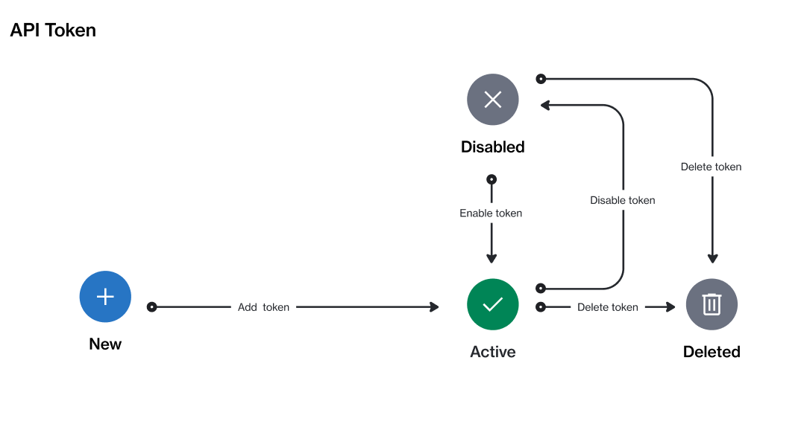

# Token status

An API token allows you to authenticate requests to the [REST API](../../../developer-resources/rest-api/).

A token can currently exist in these states: **Active**, **Disabled**, or **Deleted**. The following diagram shows the transitions between these states:

<figure><figcaption>
The state transition diagram of an API token.
</figcaption></figure>

The following table provides a description of the different statuses:

<table><thead><tr><th width="124">State</th><th>Definition</th></tr></thead><tbody><tr><td><strong>Active</strong></td><td>The token has been authenticated in the account. It will allow access to the endpoint.</td></tr><tr><td><strong>Disabled</strong></td><td>The token has been temporarily deactivated. Any attempts to access the endpoint will return an error.</td></tr><tr><td><strong>Deleted</strong></td><td>The token has been permanently removed from the system. This state is not visible to the client or vendor account users.</td></tr></tbody></table>
