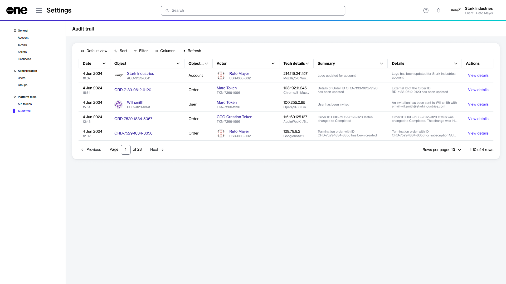
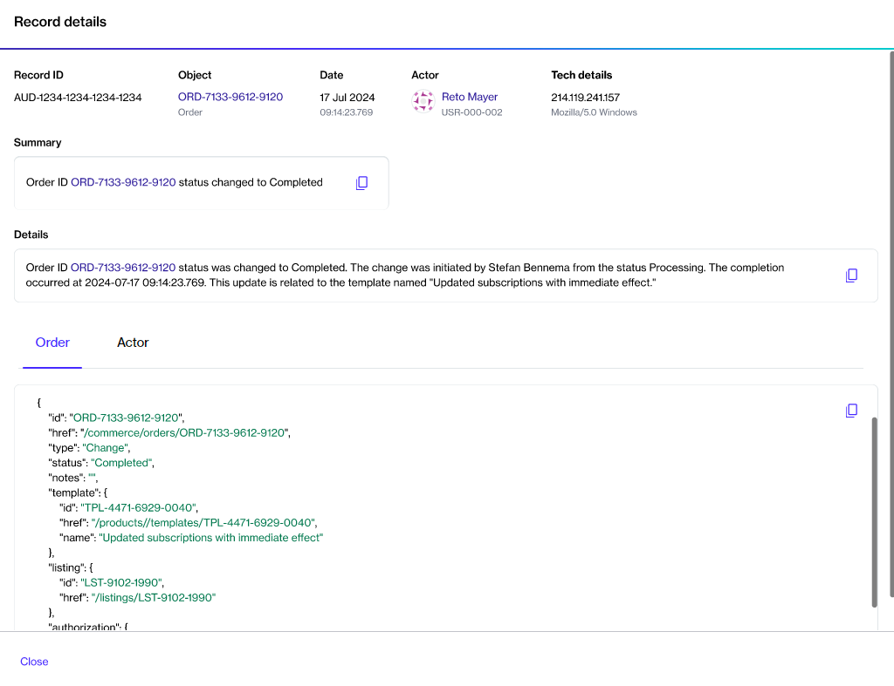

# Audit Trail

The Audit trail feature allows you to monitor and track every action taken on an object within your account.&#x20;

You can use this feature to see who made specific changes, when they made them, and in what context. It provides a detailed record of various types of actions such as data modifications, status updates, and events generated by the platform.

Each audit trail record includes timestamps, a summary of the event, object-specific details, and the actors involved.


Video: What is an Audit Trail and why is it important?


## Accessing audit trail

Account administrators can access the audit trail by selecting **Settings** > **Audit trail** from the main menu. This will allow you to view all records available at the account level.

<figure><figcaption>
Audit trail page
</figcaption></figure>

An audit trail also exists at the object level in our platform. If you want to view records for your orders, subscriptions, and more, you can see the log history within the **Audit trail** tab on the details page of your selected object. The following example shows the audit trail on the order details page:

<figure><figcaption>
Audit trail tab on the order details page
</figcaption></figure>

## Audit trail interface

At the account level, the **Audit trail** page shows all records that have been generated for your account:

<figure><figcaption>
Audit trail page
</figcaption></figure>

For each record, you can view the following details:

* **Date** - Shows the date and time when the action was performed.
* **Object** - Displays the ID of the object that was created or updated. Clicking the object ID displays the object's details page.&#x20;
* **Object type** - Shows the object associated with the event.
* **Actor** - Displays the ID of the actor who performed the action. If the action was performed by the platform, a token ID will be displayed instead.
* **Tech details** - Shows technical information for the record, including details like IP address, operating system, and more.
* **Summary** - Displays a short description of the event.
* **Details** - Displays a full description of the event.
* **Actions** - Includes the **View details** option. Selecting this option displays the **Record details** page, which includes a JSON representation of the record and allows you to copy the event summary,  description, and JSON data using the **Copy** <path d=&#x22;M360-240q-33 0-56.5-23.5T280-320v-480q0-33 23.5-56.5T360-880h360q33 0 56.5 23.5T800-800v480q0 33-23.5 56.5T720-240H360Zm0-80h360v-480H360v480ZM200-80q-33 0-56.5-23.5T120-160v-560h80v560h440v80H200Zm160-240v-480 480Z&#x22;/></svg>" data-size="line"> option.

<figure><figcaption>
Audit trail record details
</figcaption></figure>
