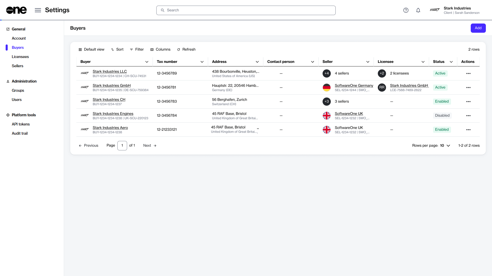
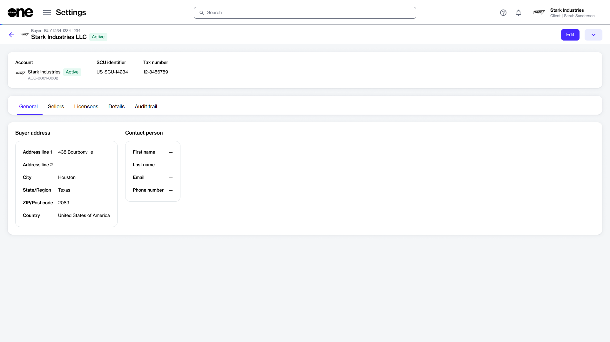

# Buyers

In the Marketplace Platform, a buyer refers to any organization or legal entity that procures products or services from SoftwareOne. Buyers are the recipients of the invoices issued by SoftwareOne. See [Key Concepts](../../../marketplace-platform/getting-started/key-concepts.md) to learn more about buyers.

As a client, you can enable or disable a buyer, and update buyer details as needed. However, you cannot add new buyers. New buyers can be added by SoftwareOne only. &#x20;

## Buyers interface 

Account administrators can access the **Buyers** page by selecting **Settings** > **Buyers** from the main menu.

<figure><figcaption>
Buyers page
</figcaption></figure>

The **Buyers** page shows a list of buyers in the account. For each buyer, you can view the following information:&#x20;

* **Buyer** - Displays the buyer's name and their unique identifier on the Marketplace platform.
* **Tax number** - Displays the tax identifier for the buyer, if available.&#x20;
* **Address** - Displays the buyer's address.
* **Contact Person** - Displays the contact person for the buyer. You can assign a contact person by editing the buyer. For instructions, see [Edit Buyers](edit-buyers.md).
* **Seller** - Displays the name of the SoftwareOne legal entity from which the buyer can procure.&#x20;
* **Licensee** - Displays the licensee mapped to the buyer.
* **Status** - Displays the buyer's status in the system. Possible values include:
  * **Enabled** - The buyer has been created in the system but it hasn't been activated yet by SoftwareOne.
  * **Active** - The buyer is active and you can select it from your list of buyers when buying products.
  * **Disabled** - The buyer has been disabled and can no longer be selected when buying products.
  * **Mismatch** - The buyer’s data is not in sync with the data in our backend system. This discrepancy can occur due to various reasons. [Contact support](../../../help-and-support/contact-support.md) for assistance.
* **Actions** - Displays options that allow you to [edit a buyer](edit-buyers.md) or [enable or disable a buyer](enable-or-disable-buyers.md). These options are visible only if you have access to the Account Management module.

## Buyer details page

The details page of a buyer provides all information related to the buyer. You can open the details page by clicking the buyer on the Buyers page. &#x20;

What can I do on this page?

From the details page, you can complete the following tasks:&#x20;

* [Edit a buyer](edit-buyers.md)
* [Enable or disable a buyer](enable-or-disable-buyers.md)

<figure><figcaption>
Details page of a buyer
</figcaption></figure>

When you open the details page, it shows the data associated with the buyer, like the name, marketplace ID, status, and so on.&#x20;

The page also contains the following tabs that display corresponding information:

* **General** - Displays the buyer's address and the contact person details.&#x20;
* **Sellers** - Displays the SoftwareOne entities linked to the buyer. Clicking the seller's name opens up the details page for the seller.&#x20;
* **Licensees** - Displays all licensees associated with the buyer.&#x20;
* **Details** - Displays reference information, such as the external IDs as well as event summary.
* **Audit trail** - Displays an audit trail of all changes. For each audit record, you can view the log details and summary. To learn more, see [Audit Trail](https://docs.platform.softwareone.com/modules-and-features/settings/audit-trail).

## Related topics


[Edit Buyers](https://app.gitbook.com/s/rouC21YfVpuUxysQFTrr/modules-and-features/settings/buyers/edit-buyers)



[Enable or Disable Buyers](https://app.gitbook.com/s/rouC21YfVpuUxysQFTrr/modules-and-features/settings/buyers/enable-or-disable-buyers)

