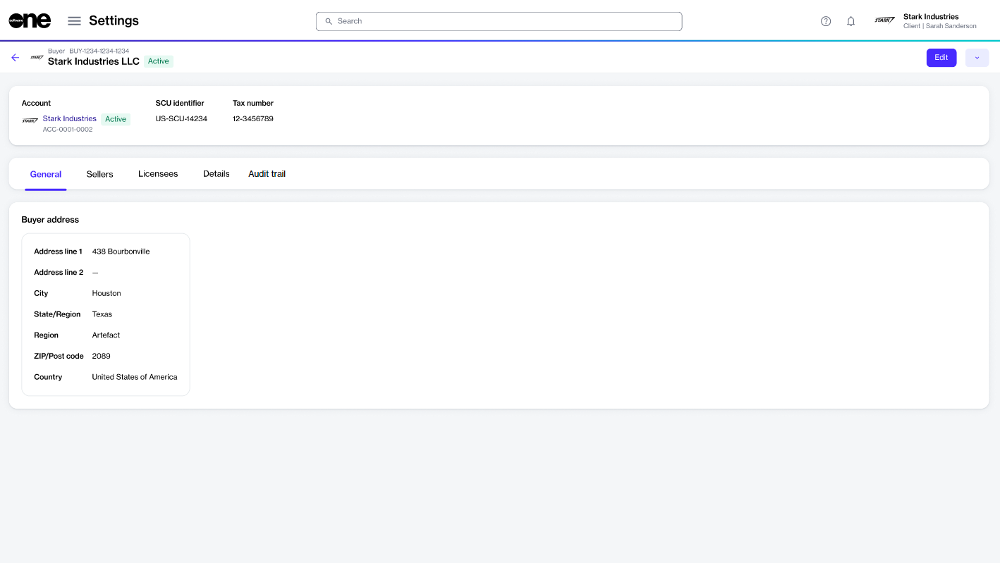

# Edit Buyers

After the buyers have been linked to your account by SoftwareOne, you can manage them through the platform and edit buyer details as needed.&#x20;

The information that you can update includes the contact person assigned to the buyer and the buyer's logo.

## Editing a buyer 

To update the buyer details in your account:

1. Navigate to the **Buyers** page in the platform. Then, select the buyer you want to update.
2. On the buyer details page, select **Edit** to start the **Edit buyer** wizard.

<figure><figcaption>
Details page of a buyer
</figcaption></figure>

3. Complete the following steps as necessary:
   1. On the **General** page, add or update the buyer's logo and select **Save**. You can upload an image by selecting **Select file** or by dragging the image into the field.&#x20;
   2. On the **Contact Person** page, choose the required setting and select **Save**:&#x20;
      * **None (leave unassigned)** - Select this to leave the contact person unassigned.
      * **Select an account user** - Select this to choose an existing user. When you select this option, all active users that exist in your account are displayed. If your account contains several users, use the **Search** option to find the user easily.
      * **Add contact details manually** - Select this to add the individual's details manually. You'll need to provide the person's first name, last name, email address, and contact information.

The buyer's details are updated, and a confirmation message is displayed.
