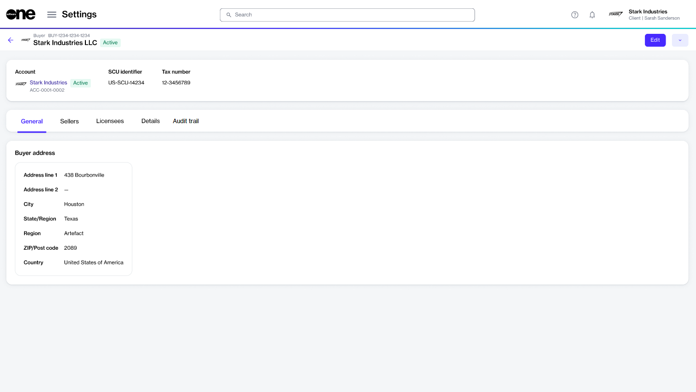

# Edit buyers

After the buyers have been linked to your account by SoftwareOne, you can manage them through the platform and edit buyer details as needed.&#x20;

The buyer information you can update includes the contact person assigned to the buyer and the buyer's logo.

### Editing a buyer 

To update the buyer details in your account:

1. Go to **Settings** > **Buyers**.&#x20;
2. Select the buyer you want to update. The buyer details page opens.
3. Select **Edit**.

<figure><figcaption>
The details page of a buyer.
</figcaption></figure>

4. In the **Edit buyer** wizard, do the following as necessary:
   * **General** - Add or update the buyer's logo. You can upload an image by selecting **Select file** or by dragging the image into the field.&#x20;
   * **Buyer address** - Update the buyer's address.
5. Select **Save**. The details are updated, and a confirmation message is displayed.
