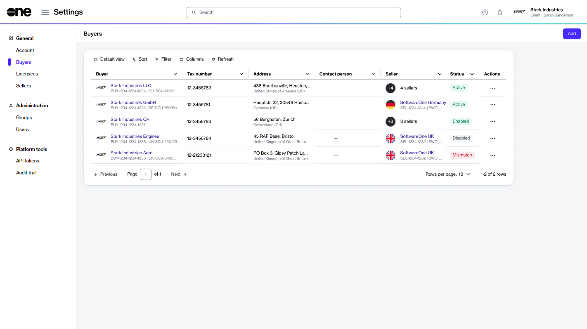

# Enable or Disable Buyers

If you no longer wish to use a buyer, you can disable them temporarily through the platform and re-enable them when required.&#x20;

When you disable a buyer, the licensees associated with that buyer also become unavailable. It means you'll no longer be able to select those licensees when creating a new agreement.&#x20;

## Enabling or disabling a buyer

Follow these steps to enable or disable a buyer:

1. On the **Buyers** page (**Settings** > **Buyers**), locate the buyer you want to manage.

<figure><figcaption>
Buyers page
</figcaption></figure>

2. Click the actions icon (**•••**) for the buyer and select **Enable** or **Disable**. Note that only one of these options is shown depending on the current state of the buyer. For example, the **Enable** option is shown only if the buyer has been disabled.&#x20;
3. Confirm that you want to enable or disable the buyer.&#x20;

A message is displayed stating that the buyer has been updated. You can view the updated buyer status on the [Buyers page](./#agreements-interface).

## Related topics


[.](./)



[edit-buyers.md](edit-buyers.md)

