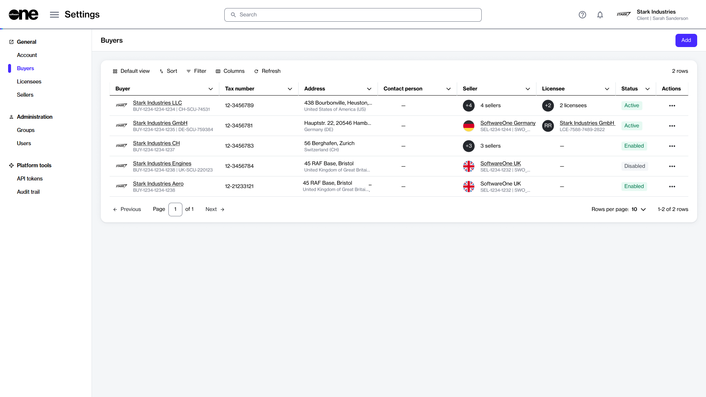

# View buyers

This topic describes how to view a list of buyers in your account, as well as details about a specific buyer.

### Viewing a list of buyers

To view a list of buyers:

1. Go to **Settings** > **Buyers**.
2. View the list of buyers displayed on the page.
3. Review information such as the buyer's name and address, tax identifier, and contact person. You can also view buyer status, including:
   1. **Enabled** - Indicates that the buyer has been created in the system, but it hasn't been activated yet by SoftwareOne.
   2. **Active** - Indicates that the buyer is active, and you can select it from your list of buyers when ordering products.
   3. **Disabled** - Indicates that the buyer has been disabled, and you can no longer select it when buying products.
   4. **Mismatch** - Indicates that the buyer’s data is not in sync with our system. This discrepancy can occur for several reasons. [Contact support](../../../help-and-support/contact-support.md) for assistance

<figure><figcaption>
The Buyers page in the platform.
</figcaption></figure>

### Viewing buyer details

On the **buyer details** page, you can view properties, such as account name, ID, and status, SCU identifier (which represents a unique ID for your customer card or profile within the SoftwareOne ERP system), and tax number.

To view buyer details:

1. Go to **Settings** > **Buyers**.
2. Select the buyer you want to view. The buyer details page opens.
3. Use the tabs on the buyer details page to access different types of information:

<table><thead><tr><th width="179">Tab</th><th>Description</th></tr></thead><tbody><tr><td><strong>General</strong></td><td>Displays the buyer's address and the contact person's details.</td></tr><tr><td><strong>Sellers</strong></td><td>Displays the SoftwareOne entity associated with the buyer. There's a 1:1 relationship between a buyer and seller, meaning each buyer is linked to one or more sellers. The <strong>ERP link status</strong> is also displayed on this tab. An <strong>ERP link</strong> is a reference to the customer record in the SoftwareOne ERP system.</td></tr><tr><td><strong>Licensees</strong></td><td>Displays the licensees associated with the buyer, along with their details. </td></tr><tr><td><strong>Details</strong></td><td>Displays timestamps for various events and external IDs, such as Customer Discount Group (CDG) and Company Contact (CON) identifiers. </td></tr><tr><td><strong>Audit trail</strong></td><td>Displays a log of events for the buyer. For more information, see <a href="../audit-trail.md">Audit Trail</a>.</td></tr></tbody></table>


* In the Marketplace platform, the buyer's address fields must meet certain requirements. If any address fields are empty on the **General** tab, the SoftwareOne ERP system automatically fills them with the word '**unknown'**. If you notice this, [contact support](../../../help-and-support/contact-support.md) for assistance.&#x20;
* If the status of the ERP link is **Blocked**, it indicates that you cannot transact with the specified seller. In such cases, [contact support](../../../help-and-support/contact-support.md) for assistance.

