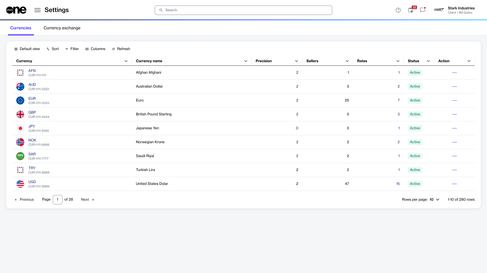

# Currencies

The **Currencies** page within the **Exchange** module provides a comprehensive overview of all currencies supported by the SoftwareOne Marketplace. This page is read-only and is intended to provide visibility into the available currencies.

### Viewing the list of currencies

To access the list of supported currencies:

1. In the main navigation menu, go to **Settings**.
2. Select **Exchange**.

The **Currencies** page displays each currency with specific attributes. For each currency, you can view the three-letter ISO code identifying the currency (for example, EUR), the full name of the currency, and precision (decimal places used for amounts in the currency).&#x20;

You can also check whether the currency is active, the total number of sellers that can transact in this currency, and the exchange rate for each currency.

<figure><figcaption>
Use the Currencies page to view configured currencies.
</figcaption></figure>

### Viewing currency details

To view currency details:

1. Go to **Settings** > **Exchange**.
2. Under **Currencies**, select the currency that you want to view. The currency details page opens.
3. Use the tabs on the currency details page to access different types of information:&#x20;

<table><thead><tr><th width="182">Tab</th><th>Description</th></tr></thead><tbody><tr><td><strong>Sellers</strong></td><td>Displays a list of sellers or SoftwareOne entities currently using this currency.</td></tr><tr><td><strong>Currency pairs</strong></td><td>Displays the currency pairs that this currency is a part of.</td></tr><tr><td><strong>Details</strong></td><td>Displays timestamps and event history details.</td></tr><tr><td><strong>Audit trail</strong></td><td>Displays the <a href="https://docs.platform.softwareone.com/modules-and-features/settings/audit-trail">audit trail</a> of the currency.</td></tr></tbody></table>
