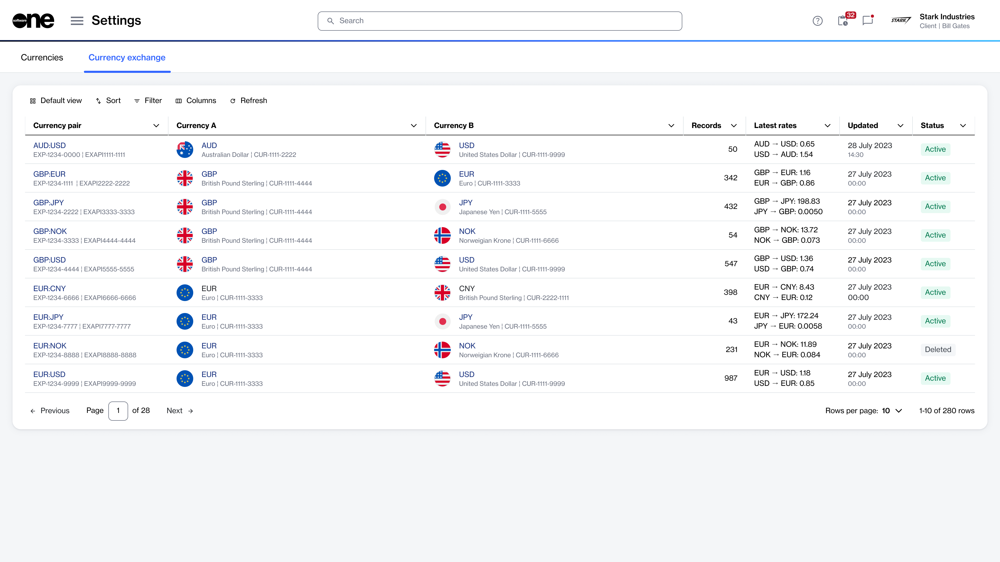

# Currency exchange

The **Currency exchange** page within the **Exchange** module provides a read‑only overview of all currency pairs and associated exchange rate data configured in the Marketplace Platform. It enables you to view exchange rate relationships between two currencies used in the Marketplace.&#x20;

### Viewing the currency pairs

To view the list of currency pairs:

1. Go to **Settings** > **Exchange**.
2. Select the **Currency exchange** tab.

The **Currencies exchange** page displays all currency pairs that have been configured for your account, for example, `GBP:EUR`. For each pair, you can view **currency A** (the first currency to form the pair) and **currency B** (the second currency to form the pair).

You can also view the latest exchange rates in both directions, how many agreements use each pair, as well as their status and last updated date.

<figure><figcaption>
Use the Currency exchange page to track rates.
</figcaption></figure>

### Viewing the currency pair details

To view currency details:

1. Go to **Settings** > **Exchange**.
2. Under **Currency exchange**, select the currency pair that you want to view. The details page for the currency pair opens.
3. Use the tabs on the currency pair details page to access different types of information:&#x20;

<table><thead><tr><th width="251">Tab</th><th>Description</th></tr></thead><tbody><tr><td><strong>Rates</strong></td><td>Displays a list of all daily exchange rates stored for the selected currency pair, with corresponding metadata.</td></tr><tr><td><strong>Details</strong></td><td>Displays timestamps and event history details.</td></tr><tr><td><strong>Audit trail</strong></td><td>Displays the <a href="https://docs.platform.softwareone.com/modules-and-features/settings/audit-trail">audit trail</a> of the currency pair.</td></tr></tbody></table>
