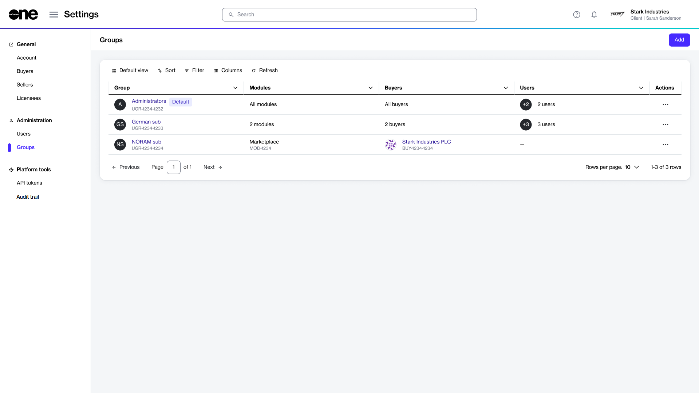

# Groups

A group represents a set of users who have the same roles and permissions. Groups are used to manage the permissions of multiple users at once, instead of at the individual user level.&#x20;

In the Marketplace Platform, users can belong to different groups within the same account. For instance, a user can belong to administrator and finance groups at the same time. They can also have different roles in each account, for instance, being an operations user in one account and administrator in another.

When working with groups in the platform, note the following points:

* Only account administrators can create new groups and manage groups details and its members.
* Users must belong to an account before administrators can add them to a group. If the individual doesn't belong to an account, their access to the marketplace platform is restricted.
* Users can belong to multiple accounts and have varying permissions in each, based on their group memberships within each account.

## Groups interface

Account administrators can access the **Groups** page by selecting **Settings** > **Groups** from the main menu.

<figure><figcaption>
Groups page
</figcaption></figure>

The page displays all groups that exist within your account. For each group, you can view the following information:

* **Group** - Displays the name and ID of the group and indicates if the group is a default one.
* **Modules** - Displays the total number of modules enabled for the group. If all modules are enabled, then **All modules** is displayed.
* **Buyers** - Displays buyers that are visible to the group members. Buyer visibility is defined by administrators while creating or editing groups. To learn more, see [Restrict Group to Certain Buyers](restrict-group-to-certain-buyers.md).
* **Users** - Displays the total number of users within a group.
* **Actions** - Contains options to [edit](edit-group.md) or [delete ](delete-group.md)a group. Select the actions icon (**•••**) to access these options.

## Groups details page 

The details page of a group displays specific information about the group, like the group name, status, and more. You can open the details page by selecting the group's name on the **Groups** page.&#x20;

What can I do on this page?

From the details page, you can complete the following tasks:&#x20;

* [Edit a group](edit-group.md)
* [Delete a group](delete-group.md)

<figure><figcaption>
Details page of a group
</figcaption></figure>

The details page is organized into the following tabs:

* **General** - Displays the group's description.&#x20;
* **Modules** - Displays modules that are enabled for the group.
* **Buyers** - Shows buyers enabled for the group. You'll either see details of selected buyers or a message stating that all buyers are enabled, based on your selection during group creation.
* **Users** - Displays all users who are a part of this group.
* **Details** - Displays the event history for the group.
* **Audit trail** - Displays an audit trail of all changes and events within the group. For each audit record, you can view the log details and summary. To learn more, see [Audit Trail](https://docs.platform.softwareone.com/modules-and-features/settings/audit-trail).

## Related topics


[create-new-group.md](create-new-group.md)



[edit-group.md](edit-group.md)



[delete-group.md](delete-group.md)



[restrict-group-to-certain-buyers.md](restrict-group-to-certain-buyers.md)

