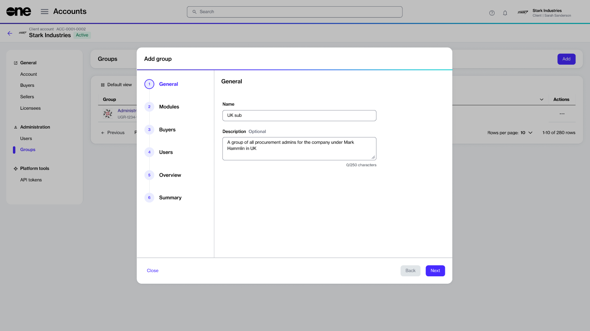
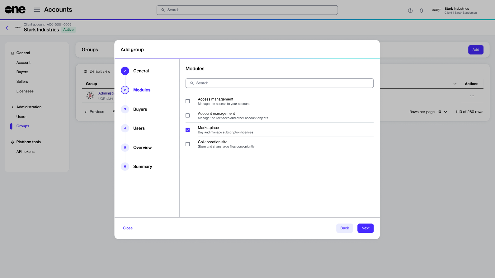
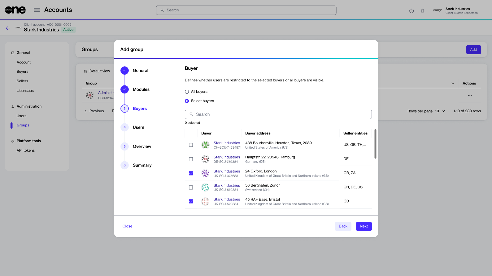
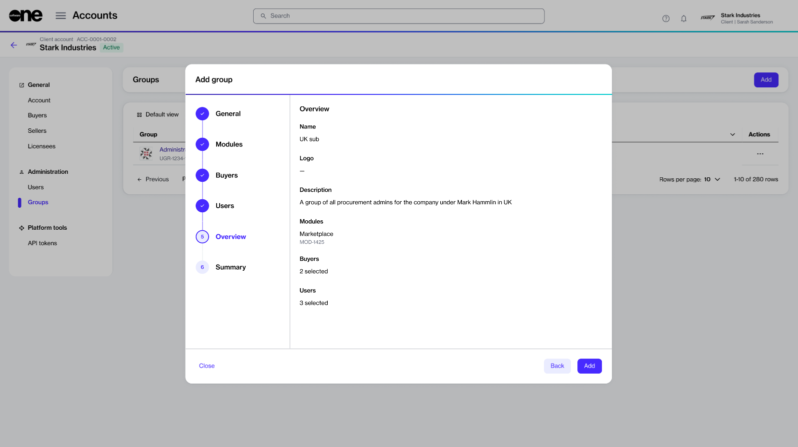
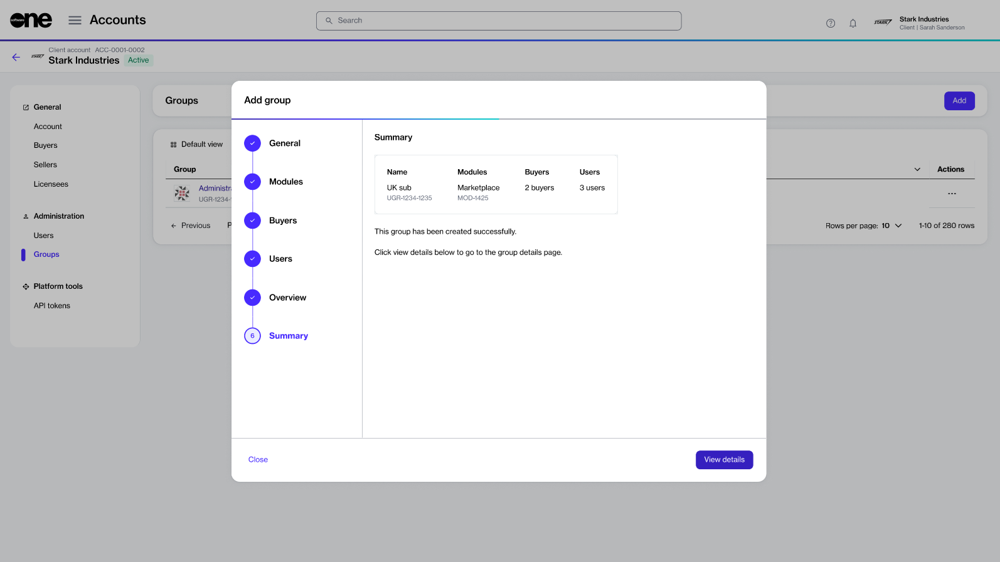

# Create New Group

In the Marketplace Platform, it's easy to create new groups and add members to those groups.&#x20;

When creating groups, you can choose all the modules you want to enable for the group members. You can also restrict group members to certain buyers. It means you can define if your group members should see all buyers in your account or specific buyers only.&#x20;

## Creating a new group

Follow these steps to create a new group:

1. On the **Groups** page (**Settings** > **Groups**) click **Add**. The **Add group** page opens.&#x20;
2. Provide the following details and click **Next**:
   * **Name** - (Required) Provide a name for your group. We recommend that you enter a unique name so you can identify the group easily in your list of groups.
   * **Description** - (Optional) Add a description for the group. You could enter information about the group members, their roles, and so on. &#x20;

<figure><figcaption>
General section
</figcaption></figure>

3. Select all modules you want to enable for the group and then click **Next**. Note that you must select at least one module.

<figure><figcaption>
Modules section
</figcaption></figure>

4. Choose if you want to allow your group members to view all buyers in your account or certain buyers only. Click **Next**.


The **Buyers** section is enabled only if you've selected the **Marketplace** module in the previous step. To learn more, see [Restrict Group to Certain Buyers](restrict-group-to-certain-buyers.md).


* **All buyers** - This option is selected by default. It allows your group members to view all buyers in your account.
* **Select buyers** - Select this option to allow group members to view only the buyers you select. When selected, all buyers will be displayed, and you can choose from the list of available buyers.

<figure><figcaption>
Buyers section
</figcaption></figure>

5. Select the individuals you want to add to the group and click **Next**. This section displays the names of all individuals in your account.

<figure><figcaption>
Users section
</figcaption></figure>

6. Review the group details and click **Add**. Your group is created and the **Summary** section displays the confirmation.&#x20;

<figure><figcaption>
Overview section
</figcaption></figure>

7. Click **View details** to open the details page of the group. Otherwise, click **Close** to close the page.

<figure><figcaption></figcaption></figure>

## Related topics


[.](./)



[edit-group.md](edit-group.md)



[delete-group.md](delete-group.md)



[restrict-group-to-certain-buyers.md](restrict-group-to-certain-buyers.md)

