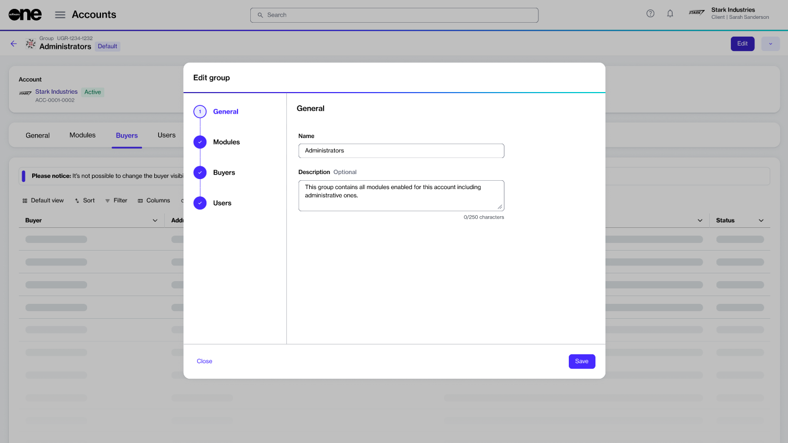
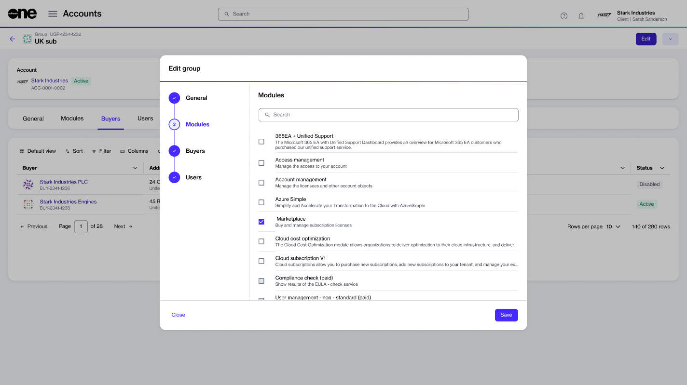
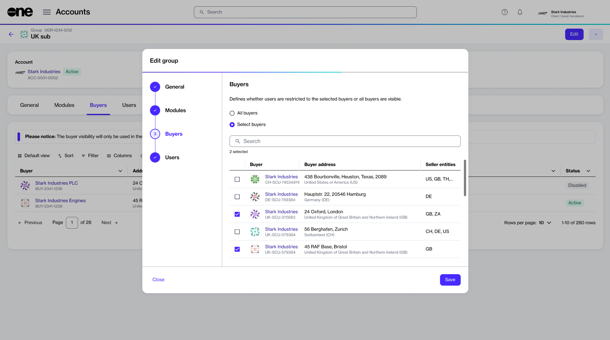
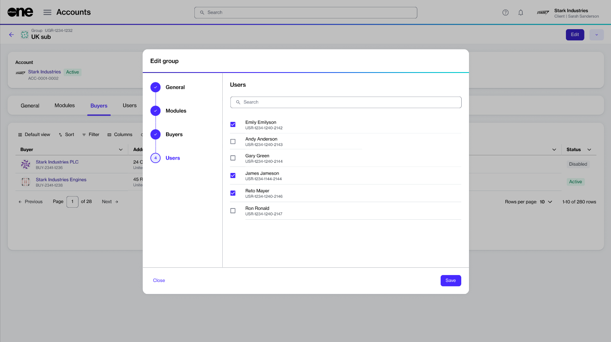

# Edit Group

You can edit a group to update the group's general information and manage group members. When editing a group, you can also update the group's buyer setting to allow full or restricted access to the buyers.

Before editing a group, note the following points:

* For default groups, you can only update the group's general information and add or remove members from the group. You can't change the modules enabled for the default group.
* You can update the buyer visibility only if the Marketplace module has been enabled for the group. If the module was not enabled during group creation, you can enable it by editing the group, as long as the group is not a default one.
* &#x20;Buyer access restrictions apply to the Marketplace module only.

## Editing a group

Follow these steps to edit a group:

1. On the **Groups** page, locate the group you want to modify.&#x20;
2. Click the actions icon (**•••**) for the group and select **Edit**. The **Edit group** page opens.
3. Make the following changes as necessary:
   * **General** - Update the group's name and description.

<figure><figcaption>
General section
</figcaption></figure>

* **Modules** - Update the modules to which the group members should have access. Note that access cannot be updated for a default group.

<figure><figcaption>
Modules section
</figcaption></figure>

* **Buyers** - Update the buyer setting for the group. This section is available only if you've enabled the Marketplace module for the group.

<figure><figcaption>
Buyers section
</figcaption></figure>

* **Users** - Add or remove users from the group as necessary. Use the checkboxes to manage members.

<figure><figcaption>
Users section
</figcaption></figure>

4. Click **Save**. A confirmation message is displayed stating that your group has been updated.

## Related topics


[.](./)



[create-new-group.md](create-new-group.md)



[delete-group.md](delete-group.md)



[restrict-group-to-certain-buyers.md](restrict-group-to-certain-buyers.md)

