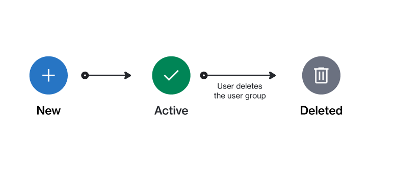

# Group states

A group represents a collection of users who share the same roles and permissions.&#x20;

A group can be in one of these states: **Active** or **Deleted**. The following diagram shows the transitions between these states:

<figure><figcaption>
The state transition diagram of a group.
</figcaption></figure>

The following table describes the different states:

<table><thead><tr><th width="146">State</th><th>Definition</th></tr></thead><tbody><tr><td><strong>Active</strong></td><td>The group is active.</td></tr><tr><td><strong>Deleted</strong></td><td>The group has been deleted and it no longer exists.</td></tr></tbody></table>
