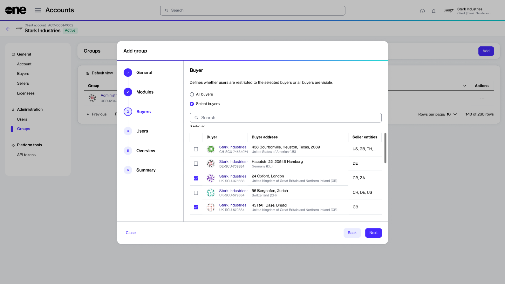

# Restrict Group to Certain Buyers

As an administrator on the Marketplace Platform, you can define whether your group of users can view all buyers in your account or only certain buyers. You can customize buyer access when creating a new group or updating an existing group.&#x20;

This feature is useful if your account contains different types of users, for example, global users and local users. Global users require access to all transactions and data across all buyers (including orders, subscriptions, and more), while local users may need their access to be limited.&#x20;

With this feature, you can apply group-level restrictions, ensuring that your group members only see the buyers and platform objects linked to their access.&#x20;


Visibility restrictions only apply to the Marketplace module in the platform.&#x20;


## Buyer-level group restrictions rules

Keep the following rules in mind:

* Only account administrators can set visibility restrictions when creating a new group or managing an existing group.

<figure><figcaption>
Buyers section
</figcaption></figure>

* Visibility restrictions apply to the Marketplace module only. Therefore, if you want to restrict a group to specific buyers, you must select the **Marketplace** module when adding or updating groups.

<figure><figcaption>
Marketplace module
</figcaption></figure>

* When a group member belongs to multiple groups, and each group has access to several buyers, the member's access is determined by the sum of all those buyers. For instance, if your account contains three groups (Group 1, Group 2, and Group 3) and five buyers (A, B, C, D, & E), the platform will apply restrictions as follows:
  * If Group 1 has access to the Marketplace module, and its members are restricted to Buyers A and B, the group members can view the Marketplace objects (like agreements, subscriptions, and more) linked to Buyers A and B.
  * If Group 2 has access to modules such as Marketplace and Procurement, and its members are restricted to Buyer C, they can only view the Marketplace objects associated with Buyer C. However, if members belong to Group 1 and Group 2, they can access the objects linked to Buyers A, B, and C.
  * If Group 3 has access to several modules, like Marketplace, Procurement, and Account Management, and its members are restricted to Buyer D, they can only view the Marketplace objects associated with Buyer D. If the users in Group 3 require access to Buyers A, B, and C, they must also be members of Groups 1 and 2.

## Restricting a group to a certain buyer

You can apply buyer-level restrictions when creating new groups or editing existing ones. For instructions, see [Create New Group](create-new-group.md) and [Edit Group](edit-group.md).&#x20;

## Related topics


[Groups](https://app.gitbook.com/s/rouC21YfVpuUxysQFTrr/modules-and-features/settings/groups)



[Delete Group](https://app.gitbook.com/s/rouC21YfVpuUxysQFTrr/modules-and-features/settings/groups/delete-group)

