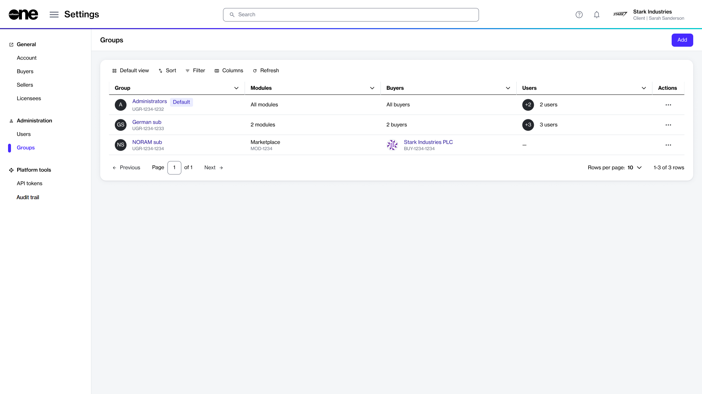

# View groups

This topic describes how to view a list of groups you have created, as well as details about a specific group.

### Viewing a list of groups

To view a list of groups:

1. Go to **Settings** > **Groups**.
2. View the list of groups displayed on the page.
3. Review information such as the group name, the total number of users it contains, and buyers visible to the group members, and more.&#x20;

Note that buyer visibility is defined by administrators while creating or editing groups. For more information, see [Restrict groups to certain buyers](restrict-group-to-certain-buyers.md).

<figure><figcaption>
Use the Groups page to view and manage groups.
</figcaption></figure>

### Viewing group details 

On the **group details** page, you can view detailed information for your selected group.

To view group details:

1. Go to **Settings** > **Groups**.
2. Select the group you want to view. The group details page opens.
3. Use the tabs on the group details page to access additional information:&#x20;

<table><thead><tr><th width="169">Tab</th><th>Description</th></tr></thead><tbody><tr><td><strong>General</strong></td><td>Displays the group's description. </td></tr><tr><td><strong>Modules</strong></td><td>Displays modules that are enabled for the group.</td></tr><tr><td><strong>Buyers</strong></td><td>Shows buyers enabled for the group. You'll either see details of selected buyers or a message stating that all buyers are enabled, based on your selection during group creation.</td></tr><tr><td><strong>Users</strong></td><td>Displays all users who are a part of this group.</td></tr><tr><td><strong>Details</strong></td><td>Displays the event history for the group.</td></tr><tr><td><strong>Audit trail</strong></td><td>Displays an audit trail for the group. For more information, see <a href="../audit-trail.md">Audit trail</a></td></tr></tbody></table>
