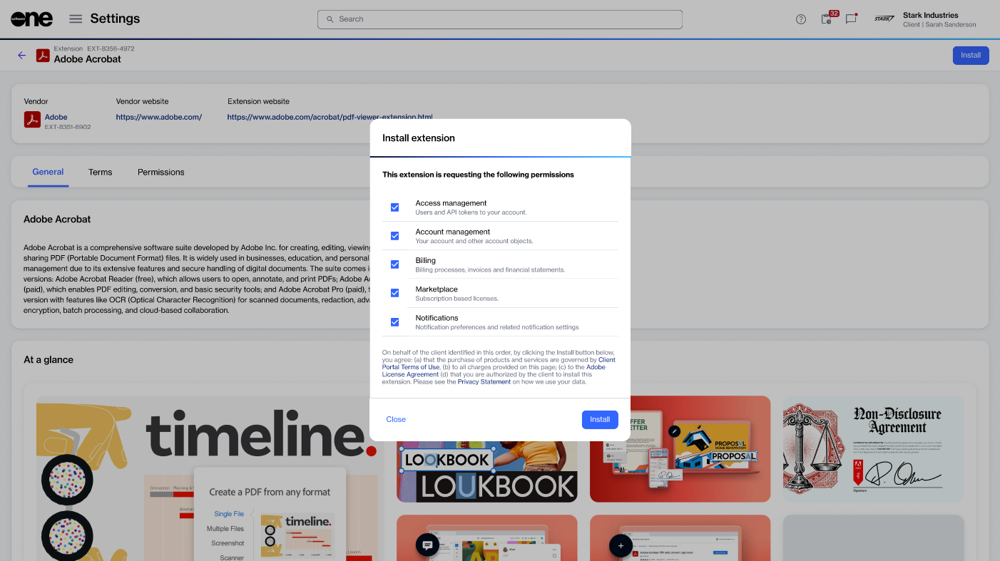
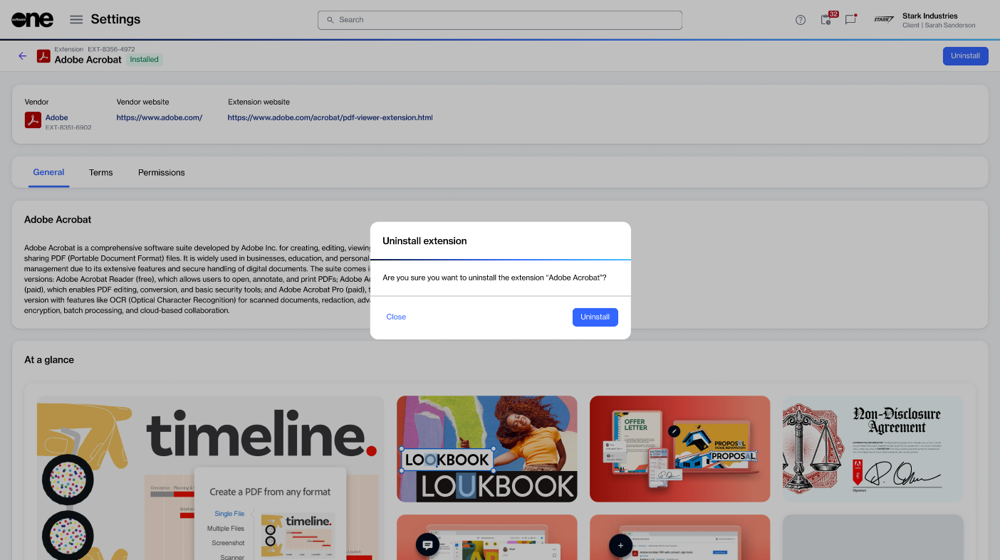

# Install or uninstall an extension

This topic describes how to install an extension available in our extensions directory. It also describes how to uninstall an extension.

### Installing an extension

To install an extension:

1. Go to **Settings** > **Integrations**.
2. Under **Extensions**, locate the extension you want to install, then select the extension to open its details page.
3. On the **Details** page, review information about the extension, including documentation, permissions, and terms of service. When done, select **Install**.
4. In the **Install Extension** dialog, review the requested permissions and use the links to view the extension’s terms and conditions and privacy statement.

<figure><figcaption>
Review the requested permissions and read the terms and conditions and privacy statement
</figcaption></figure>

5. Select **Install** to begin the installation process.

Once installed, the extension will show an **Installed** status on the **Extensions** page. You can view more details about the installed extension either by selecting it on the **Extensions** page or from the **Installations** tab.&#x20;

Depending on the extension, it may appear in multiple locations within the platform. Check the main navigation menu, relevant modules, or details pages to access the installed extension's features.

### Uninstalling an extension

You can uninstall an extension if it's no longer needed.

To uninstall an extension:

1. Perform one of the following steps:
   * On the **Extensions** page, select the extension you want to uninstall.
   * On **Installations** tab, locate and select the extension you want to uninstall.&#x20;
2. On the extension details page, select **Uninstall**.

<figure><figcaption>
Uninstall your selected extension.
</figcaption></figure>

3. In the **Uninstall extension** dialog, select **Uninstall** to confirm.

Your selected extension is uninstalled. You can reinstall the same extension at any time if needed.
