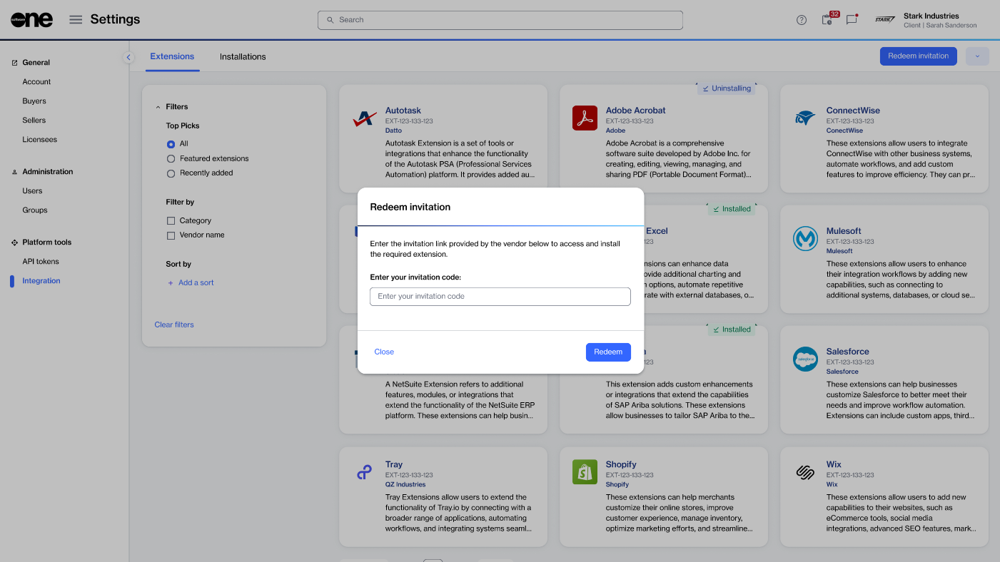

# Redeem invitation

If you have received an invitation code to install an extension, you can use it to add the extension to your account.&#x20;

In the SoftwareOne Marketplace, invitation codes can be shared by SoftwareOne associates, vendors, or partners. Extensions installed this way are private. It means they won’t appear in the catalog and can only be installed directly using the invitation code.

### Redeeming an invitation

To redeem an invitation:

1. Open the **Integrations** page.
2. Select **Redeem invitation**.
3. In the **Redeem invitation** dialog, enter your invitation code, then select **Redeem**.

<figure><figcaption>
Redeem your invitation code.
</figcaption></figure>

4. In the **Redeem invitation** dialog, select **Confirm**.
5. On the extension details page, select **Install** to begin the installation process.
