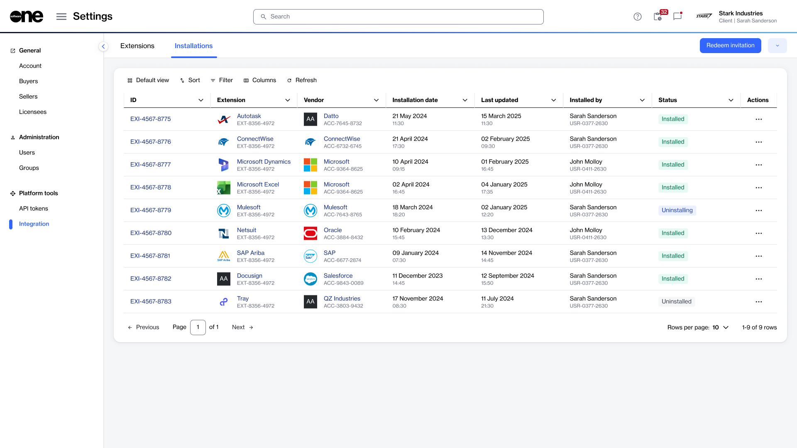
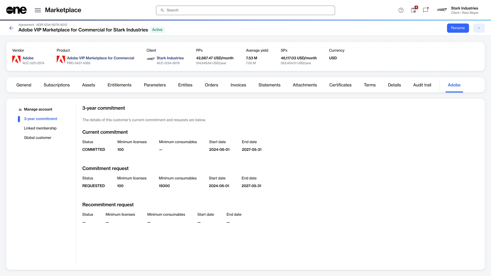

# View installed extensions

This topic describes how to view your installed extensions and access their features.

### Viewing your installed extensions

To view your installed extensions:

1. Go to **Settings** > **Integration**.
2. Select the **Installations** tab.
3. Use the **Status** column to identify installed extensions.

<figure><figcaption>
Use the Installations tab to view your installed extensions.
</figcaption></figure>

### Access an extension’s features

After an extension has been installed, it can appear in several predefined locations within the platform. Depending on the extension, it may appear in the main navigation menu, relevant modules, or details pages.&#x20;

The following image shows an example of an installed **Adobe** extension on an **agreement details** page:

<figure><figcaption>
Example of an installed Adobe extension on the agreement details page.
</figcaption></figure>

