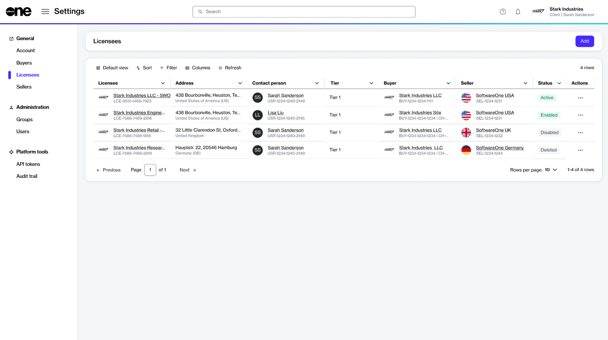

# Licensees

A licensee represents a specific person or a department within your account that receives the license to use the product.&#x20;

Licensees are linked to the buyers and sellers in your account. There can be multiple licensees in an account, however, a licensee can only be linked to one buyer and one seller. You can learn about licensees in [Key Concepts](../../../marketplace-platform/getting-started/key-concepts.md).

Initially, the licensees are created by SoftwareOne and mapped to the different buyers and sellers within your account. However, you can easily manage the licensees and create new ones through the interface.

## Licensee interface 

Account administrators can access the **Licensees** page by selecting **Settings** > **Licensees** from the main menu.&#x20;

<figure><figcaption>
Licensees page
</figcaption></figure>

The page displays all licensees that exist in your account. For each licensee, you can view the following details:

* **Licensee** - Displays the name and unique identifier of the licensee. The name can be the name of a user, a company name, or a department name.
* **Address** - Displays the address of the licensee.
* **Contact person** - Displays the contact person associated with the licensee.
* **Buyer** - Displays the buyer that has been mapped to the licensee.
* **Seller** - Displays the SoftwareOne entity that is responsible for facilitating the procurement of products and licenses.
* **Status** - Displays the licensee's status in the platform. To learn about the possible states, see [Licensee States](licensee-states.md).
* **Actions** - Displays options that allow you to manage your licensees. Depending on your permissions, you can update licensee information, and enable or disable a licensee.

## Licensee details page 

The details page of a licensee displays the additional information about the licensee. You can open the details page by clicking the licensee name on the **Licensees** page.

What can I do on this page?

From the details page of a licensee, you can perform the following tasks:&#x20;

* [Edit a licensee](edit-licensees.md)
* [Enable or disable a licensee](enable-or-disable-licensees.md)

<figure><figcaption>
Details page of a licensee
</figcaption></figure>

The details page shows the licensee's name, marketplace ID, and status. It also shows the associated buyer and seller entities, and contains the following tabs:&#x20;

* **General** - Displays the licensee's mailing address and contact person details.&#x20;
* **Details** - Displays date and time information for the licensee, for example, the date and time when the licensee was created in the system and so on.
* **Audit trail** - Displays an audit trail of all changes made in the scope of the licensee. For each audit record, you can view the log details and summary. To learn more, see [Audit Trail](https://docs.platform.softwareone.com/modules-and-features/settings/audit-trail).

## Related topics


[Licensee States](https://app.gitbook.com/s/rouC21YfVpuUxysQFTrr/modules-and-features/settings/licensees/licensee-states)



[Create Licensee](https://app.gitbook.com/s/rouC21YfVpuUxysQFTrr/modules-and-features/settings/licensees/create-licensees)



[Edit Licensee](https://app.gitbook.com/s/rouC21YfVpuUxysQFTrr/modules-and-features/settings/licensees/edit-licensees)



[Enable or Disable Licensee](https://app.gitbook.com/s/rouC21YfVpuUxysQFTrr/modules-and-features/settings/licensees/enable-or-disable-licensees)

