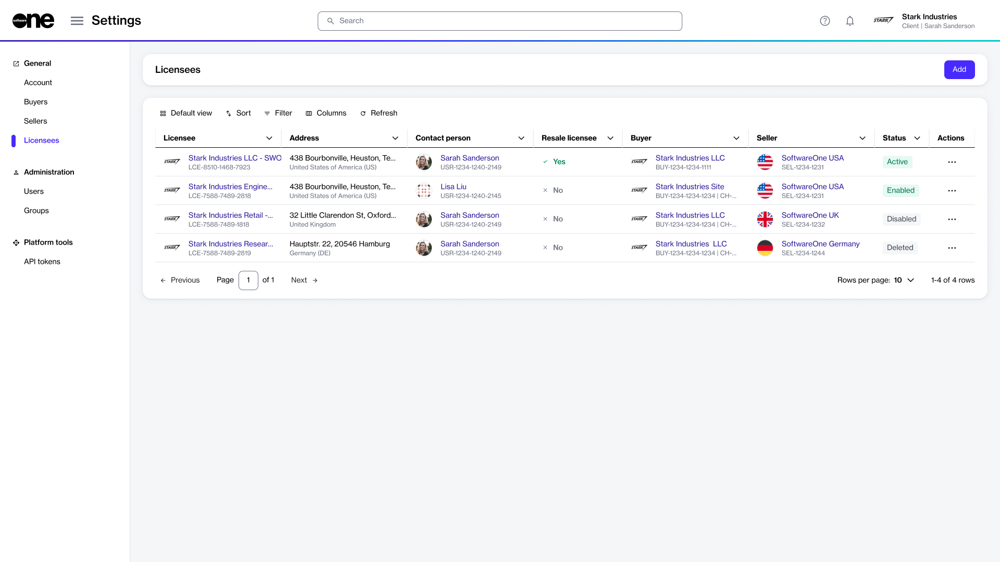
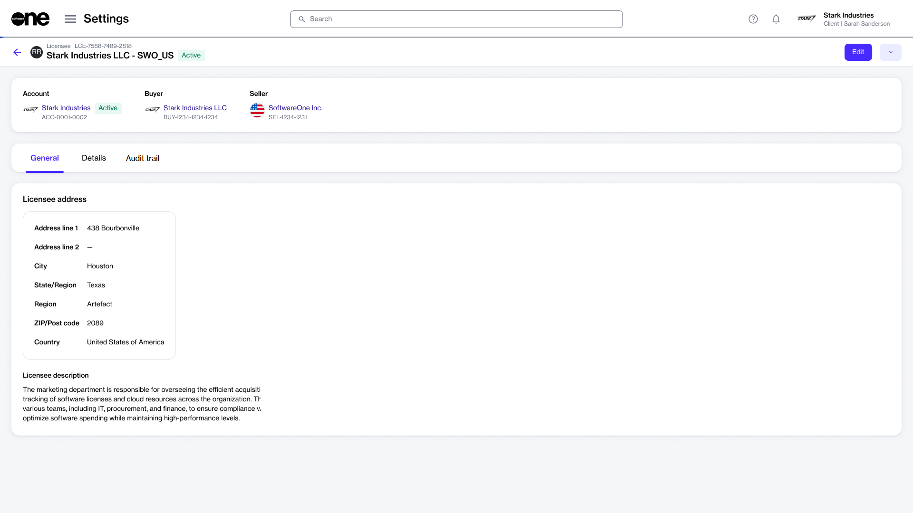

# Licensees

In the Marketplace Platform, a licensee is a specific person or a department within your account that receives the license to use the product.&#x20;

Licensees are connected to the buyers and sellers in your account. There can be multiple licensees in an account, but each licensee can only be linked to one buyer and one seller. To learn more, see [Key Concepts](../../../marketplace-platform/getting-started/key-concepts.md).

Account administrators can view and manage licensees on the **Licensees** page in the platform.&#x20;

<figure><figcaption>
The Licensees page in the platform.
</figcaption></figure>

The page shows all the licensees in your account. For each licensee, you can view details such as the name and unique identifier of the licensee, their address, current status, and more.&#x20;

You can also determine if the licensee has been configured as a resale licensee, who will be involved in reselling the product instead of buying it for self-consumption.&#x20;

Additionally, you have options that allow you to manage a licensee. Depending on your permissions, you can update licensee information and enable or disable a licensee.

## Viewing licensee details 

To view the details page of a licensee, select the licensee on the **Licensee** page.&#x20;

<figure><figcaption>
The details page of a licensee.
</figcaption></figure>

The details page shows the licensee's name, marketplace ID, and status. It also shows the associated buyer and seller entities, and contains the following tabs:&#x20;

<table><thead><tr><th width="156">Tab</th><th>Description</th></tr></thead><tbody><tr><td><strong>General</strong></td><td>Displays the licensee's mailing address and contact person details. </td></tr><tr><td><strong>Details</strong></td><td>Displays date and time information for the licensee, for example, the date and time when the licensee was created in the system, and so on.</td></tr><tr><td><strong>Audit trail</strong></td><td>Displays an audit trail of all changes made in the scope of the licensee. For each audit record, you can view the log details and summary. To learn more, see <a href="../audit-trail.md">Audit Trail</a>.</td></tr></tbody></table>

## Additional actions

You can perform various actions on the details page. The available actions depend on the licensee's current status in the platform:

* [Edit licensee](edit-licensees.md)
* [Enable or disable a licensee](enable-or-disable-licensees.md)
