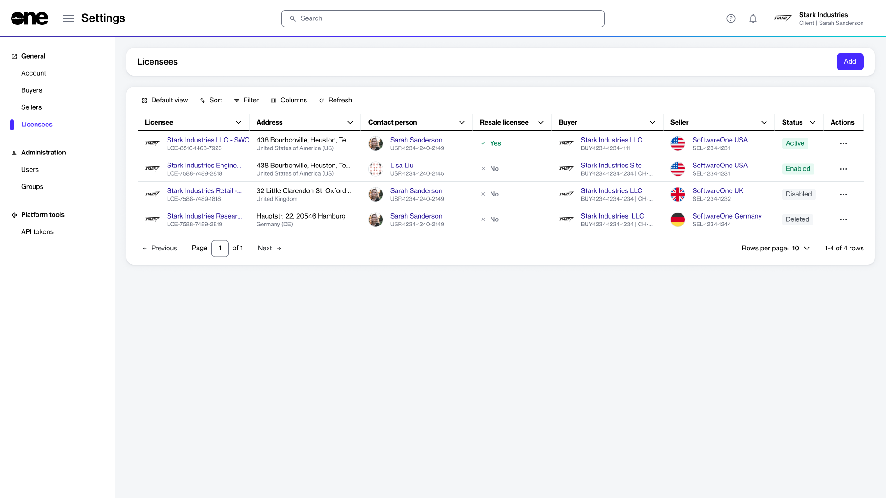

# Licensees

A licensee is a specific person or a department within your account that receives the license to use the product.&#x20;

Licensees are the entities that consume the software products or services procured by the buyer. In the SoftwareOne Marketplace, licensees are connected to buyers and sellers, and they are critical in establishing new agreements. Your account may contain multiple licensees, but each licensee can only be connected to one buyer and one seller at a time.

### Accessing licensees

The **Licensees** page allows account administrators to add new licensees. Administrators can also use this page to view, modify, enable, or disable a licensee.

To navigate to the **Licensees** page, select the main menu, then choose **Settings** > **Licensees**. The list of licensees is displayed, as shown in the following image:

<figure><figcaption>
The Licensees page in the platform.
</figcaption></figure>

On the **Licensees** page, you can use the [sort and filter options](../../../marketplace-platform/getting-started/interface/customize-the-data-grid.md) and [show or hide specific columns](../../../marketplace-platform/getting-started/interface/customize-the-data-grid.md#managing-columns) to customize the list. You can also view a licensee's details by selecting their name, and you can manage the licensee by using the options in the **Actions** column.

### Related topics


[licensee-states.md](licensee-states.md)



[create-licensees.md](create-licensees.md)



[view-licensees.md](view-licensees.md)



[edit-licensees.md](edit-licensees.md)



[enable-or-disable-licensees.md](enable-or-disable-licensees.md)

