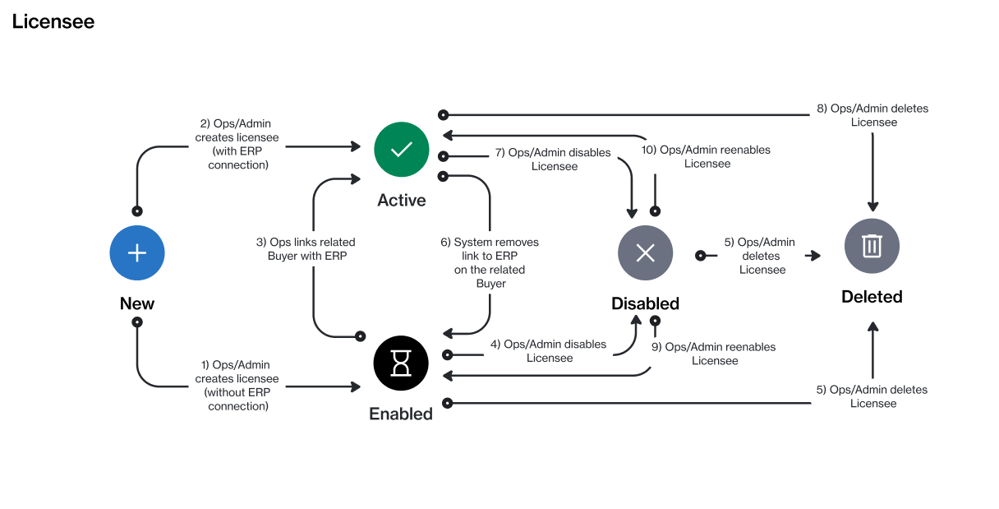

# Licensee States

Licensees in the Marketplace Platform can be in multiple states (also known as status).

The following diagram shows the possible states and the transition between these states:

<figure><figcaption>
The state transition diagram of a licensee.
</figcaption></figure>

<table><thead><tr><th width="111">State</th><th>Definition</th></tr></thead><tbody><tr><td><strong>Active</strong></td><td>The licensee is active and can be used when buying products in the platform. </td></tr><tr><td><strong>Enabled</strong></td><td>The licensee has been set up in the system, but can't be used for transactions.</td></tr><tr><td><strong>Disabled</strong></td><td>The licensee has been disabled and can no longer be used.</td></tr><tr><td><strong>Deleted</strong></td><td>The licensee has been deleted.</td></tr></tbody></table>
