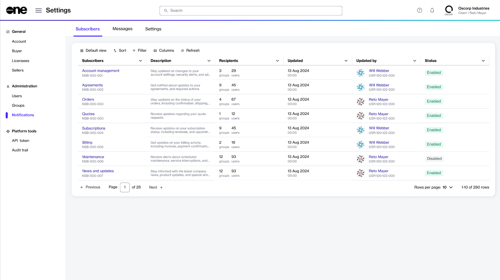

# Notifications

Notifications Management allows account administrators to configure recipients and manage subscribers (also called categories) for their Marketplace account.&#x20;

Notifications are email alerts sent from SoftwareOne's email address and may include updates related to order status changes, subscription modifications (upsizes or downsizes), invoice generation, and more. These alerts help you stay informed and take proactive actions as necessary.

Admins can manage notifications for their account from the **Notifications** page. Individual users can [manage notifications](../../../marketplace-platform/getting-started/interface/manage-notification-preferences.md) for their profile through the **My profile** option in the account menu.&#x20;

### Accessing notifications 

Account administrators can view notification categories and messages triggered for their account by navigating to **Settings** > **Notifications**.

<figure><figcaption>
The Notifications page in the platform.
</figcaption></figure>

### Subscribers

The Marketplace Platform supports notification subscribers (referred to as categories) to help you manage email preferences. These categories group related messages together, so you can manage preferences at the category level, instead of managing each email individually.

For example, the **Orders** notification category includes all alerts related to your orders, like order confirmations and status updates. If you choose to disable this category, you'll stop receiving all emails related to your Marketplace orders.&#x20;

To see all available categories:

* Go to **Settings** > **Notifications** > **Subscribers**. To manage these categories, see [Enable or Disable Categories](enable-or-disable-categories.md).

### Messages

The Marketplace Platform stores all email messages that have been triggered at the account level.&#x20;

Administrators can view a list of messages and detailed information for each message, including the message ID, recipient's email address, message status, and more.&#x20;

To see the messages:

* Go to **Settings** > **Notifications** > **Messages**. For more information, see [View Notification Messages](view-notification-messages.md).
