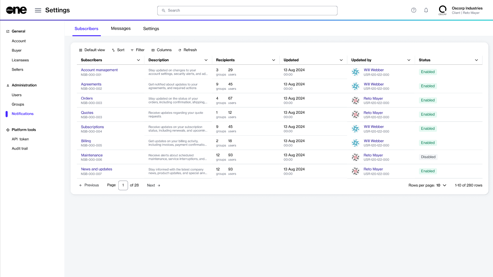

# Notifications

Notifications Management allows account administrators to configure recipients and manage subscribers (also called categories) for their Marketplace account.

Notifications are email alerts sent from SoftwareOne's email address and may include updates related to order status changes, subscription modifications (upsizes or downsizes), invoice generation, and more. These alerts help you stay informed and take proactive actions as necessary.

Admins can manage notifications for their account from the **Notifications** page. Individual users can [manage notifications](../../../marketplace-platform/getting-started/interface/manage-notification-preferences.md) for their profile through the **My profile** option in the account menu.&#x20;

### Notification subscribers (categories)

The Marketplace Platform supports notification subscribers (referred to as categories) to help you manage email preferences. These categories group related messages together, so you can manage preferences at the category level, instead of managing each email individually.

For example, the **Orders** notification category includes all alerts related to your orders, like order confirmations and status updates. If you choose to disable this category, you'll stop receiving all emails related to your Marketplace orders.

To see a list of categories, go to **Notifications** > **Subscribers**. To manage these categories, see [Enable or disable categories](enable-or-disable-categories.md).

<figure><figcaption>
Use the Notifications page to view subscribers, messages, and settings.
</figcaption></figure>

### Notification messages

The platform stores all notification emails sent at the account level.

Administrators can view a list of messages and detailed information for each message, including the message ID, recipient's email address, message status, and more.&#x20;

To view the list of messages, go to **Notifications** > **Messages**. For more information, see [View notification messages](view-notification-messages.md).

### Notification settings

The **Settings** tab allows account administrators to customize the global email notification settings, including the sender name displayed to recipients and the information that appears within the footer of every notification email.

To manage settings, see [Customize notification settings](edit-notification-settings.md).

### Related topics


[notification-states.md](notification-states.md)



[configure-recipients.md](configure-recipients.md)



[enable-or-disable-categories.md](enable-or-disable-categories.md)



[view-notification-messages.md](view-notification-messages.md)



[edit-notification-settings.md](edit-notification-settings.md)

