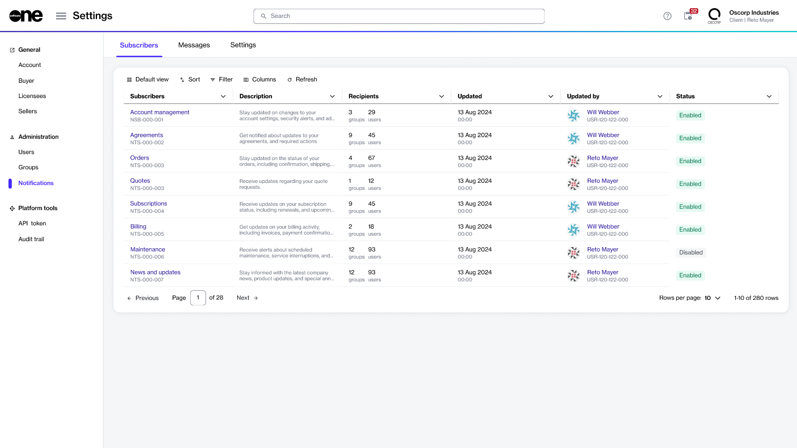
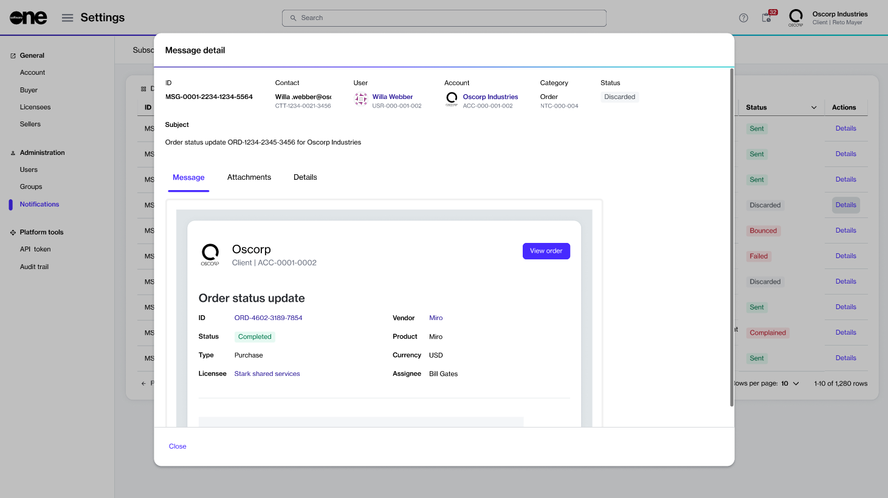

# Notifications

The Notifications module in the Marketplace Platform lets account administrators configure and manage email notifications for the account.

Administrators can enable email notifications each time a certain event takes place within the account, for instance, when the status of an order changes, a new agreement is created, platform maintenance is upcoming, and more. The Marketplace Platform supports various notification categories and sends emails to only those recipients defined by an administrator for each category.


Individual users can also manage their notification preferences through the platform. This can be done through the **My profile** option in the account menu. See [Manage Email Notifications](../../../marketplace-platform/getting-started/interface/manage-notification-preferences.md) to learn more.&#x20;


## Notification categories 

In the Marketplace Platform, all notifications are grouped into specific categories.&#x20;

Each category consolidates emails of a similar type, allowing you to manage your preferences at the category level instead of handling each email individually. The following table lists the supported notification categories:

| Notification categories | Description                                                                                                                                                                   |
| ----------------------- | ----------------------------------------------------------------------------------------------------------------------------------------------------------------------------- |
| Account updates         | These notifications alert recipients to the changes in the account. For instance, when a new user is added or an existing one is removed.                                     |
| Agreements              | These notifications are sent when there are changes to an agreement. For instance, when an agreement is newly created or terminated.                                          |
| Billing and Invoice     | These notifications relate to billing updates and invoices in your account. For instance, when a new statement is generated.                                                  |
| News and updates        | These notifications alert recipients to the platform news and latest announcements, such as feature releases, upcoming maintenance, and more.                                 |
| Orders                  | These notifications are sent when there's an order-related activity in your account. For instance, when you place a new order or the status of your existing order changes.   |
| Quotes                  | These notifications relate to your requests for a quotation.                                                                                                                  |
| Requests                | These notifications alert you to the submitted requests in your account. For instance, when the status of your request changes, when you need to action a request, and so on. |
| Subscriptions           | The platform sends these notifications when there are subscription-related updates to your account. For instance, renewal updates or when a new subscription is created.      |
| User updates            | These email notifications are sent when you update your profile. For instance, when you update your password. You cannot opt out of these notifications.                      |

You can manage these categories from the **Notifications** > **Configuration** page. See [Enable or Disable Categories](enable-or-disable-categories.md) to learn more.

## Notifications interface 

Account administrators can access notifications by selecting **Settings** > **Notifications** from the main menu.

<figure><figcaption>
Notifications page
</figcaption></figure>

The **Notifications** page contains these three tabs: **Configuration**, **Messages**, and **Settings**. Each of these tabs is described in the following sections.&#x20;

### Configuration

The **Configuration** tab displays all [notification categories](./#notification_types) configured for your account. For each notification, you can view the following details:

* **Configuration** - Displays the name of the category.&#x20;
* **Description** - Displays a short description of the category.
* **Recipients** - Shows the total number of users and groups who are the recipients of the notifications.
* **Updated** - Shows the date and time when the notification's configuration was updated.&#x20;
* **Last used** - Shows the date and time when the platform sent the notification.&#x20;
* **Updated by** - Displays the name and ID of the individual who updated the notification's configuration.&#x20;
* **Status** - Indicates whether the category is enabled or disabled.&#x20;

Clicking the notification type opens up its details page from where you can manage the configuration for your required notification category.&#x20;

The details page is organized into tabs, which provide general information, and an audit trail, and let you define and manage recipients and groups for your selected category. From this page, you can also enable or disable the category. See [Configure Recipients](configure-recipients.md) and [Enable or Disable Categories](enable-or-disable-categories.md) for more details.

<figure><figcaption>
Configuration details page
</figcaption></figure>

### Messages

The **Messages** tab contains all messages sent to the users in your account. For each message, you can view the following details:

* **ID** - Displays the ID assigned to the message by the platform.
* **Contact** -
* **User** -
* **Subject** -
* **Category** -
* **Created** -
* **Created by** -
* **Status** - Displays the status of the message. To learn about the possible statuses, see [Notification States](notification-states.md).
* **Actions** -&#x20;

Clicking **Details** in the **Action** column displays the **Message details** page, where you can view the general information, the full content of the email, file attachments, and associated time and date details.

<figure><figcaption>
Message details page
</figcaption></figure>

### Settings

The **Settings** tab allows you to view and edit your account-level notification settings, such as the sender name, the language of emails, and the email's footer. See [Edit Notification Settings](edit-notification-settings.md) for details.&#x20;

<figure><figcaption>
Edit notfication settings
</figcaption></figure>
