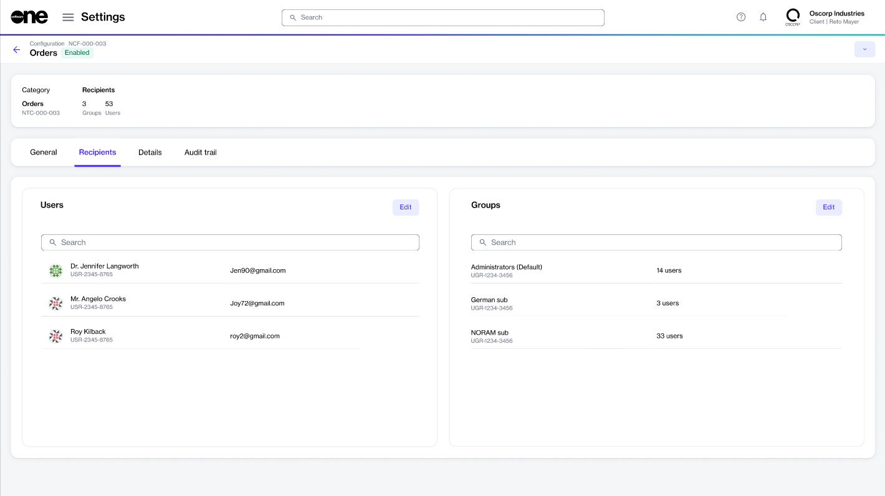

# Configure Recipients

Configuring recipients for your notifications is necessary so you can start receiving emails about various events in your account.&#x20;

Account administrators can configure new recipients for a [notification category](./#notification_types) and manage the existing ones. Recipients include individual users who exist in your account or a group of users who must be notified about specific events.&#x20;

Once configured, the platform will start sending notifications to your chosen recipients. For example, if you set up recipients for subscription-related notifications, they will receive alerts when a subscription is updated or nearing expiration.&#x20;

Administrators can also manage existing recipients by adding or removing users or groups as necessary.

## Configuring recipients for notifications

Follow these steps to configure users and groups for your email notifications:


The Administrator group is a default email notification group containing recipients who will always receive email notifications. (Can it be unselected or changed?)


1. From the main menu, go to **Settings** > **Notifications** and select the **Configuration** tab.&#x20;
2. Select the notification category for which you wish to configure recipients. For example, to configure recipients for order-related notifications, select **Orders**.
3. On the details page, select the **Recipients** tab.

<figure><figcaption>
Recipients tab
</figcaption></figure>

4. Do the following as required:
   * To add users, click **Edit** in the **Users** section and select all users who should receive notification emails.
   * To add groups, click **Edit** in the **Groups** section and select the required groups. The **Administrator** group is the default group and cannot be changed. It means that account administrators will receive all notifications.&#x20;
5. **Save** your changes. The updated list of recipients is displayed on the page.&#x20;

## Removing existing recipients

You can manage your list of recipients by clicking **Edit** on the **Recipients** tab, the same button you used to configure users and groups.&#x20;

The following image shows the **Edit users** dialog, which opens when you click the **Edit** button in the **Users** section.&#x20;

To remove a user, clear the checkbox for that user and then save your changes.

<figure><figcaption>
Remove a user
</figcaption></figure>

Similarly, to remove a group, clear the checkbox for that group and then save your changes.&#x20;

<figure><figcaption>
Remove a group
</figcaption></figure>
