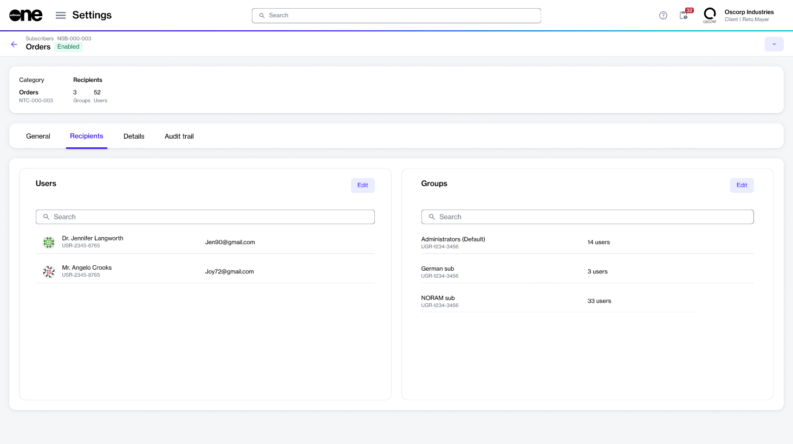
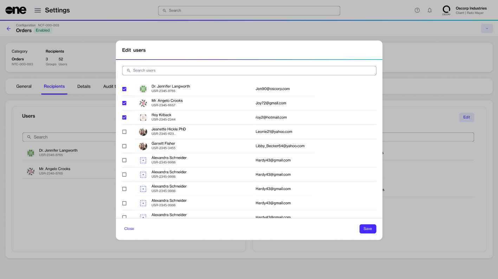
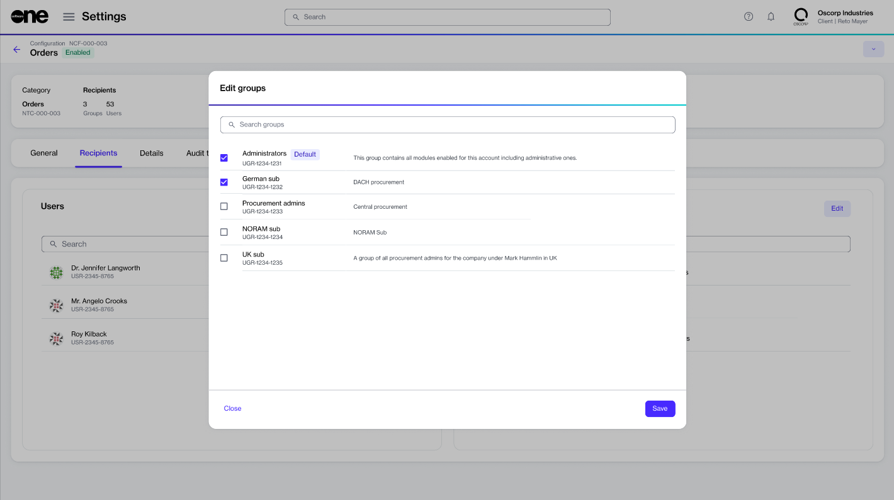

# Configure Recipients

Configuring recipients for your notifications is necessary so you can start receiving timely updates about various events in your account.&#x20;

Account administrators can define recipients for each [notification category](./#notification_types). Recipients include specific users as well as a group of users who will be informed when a certain event is triggered. For example, if subscription-related notifications are enabled, recipients will receive an email alert when a specific subscription is updated.&#x20;

Administrators can also manage recipients for an email message by adding new ones or removing existing ones.

## Adding recipients

To add specific users and groups to your email notifications:

1. Navigate to the **Notifications** page.&#x20;
2. On the **Subscribers** tab, select the relevant category. For example, to configure recipients for order-related notifications, select **Orders**.
3. On the details page, select the **Recipients** tab.

<figure><figcaption>
Recipients tab on the Subscriber details page
</figcaption></figure>

4. Define the recipients:
   * To define specific users, select **Edit** in the **Users** section and select all users who should receive email messages. Note that only active users are displayed in this list. If a user you want to add isn't displayed, make sure they have been [added to your account](../users/add-new-users.md).
   * To add groups, select **Edit** in the **Groups** section and choose the required groups. You can select multiple groups from the list.&#x20;
5. Select **Save**. Your list of recipients is updated for the selected category.&#x20;

## Removing recipients

You can manage your recipients using the **Edit** option on the **Recipients** tab within the subscriber details page.

* To remove a user, clear the checkbox next to that user and save your changes.

<figure><figcaption>
Remove a user from your email notifications
</figcaption></figure>

* To remove a group, clear the checkbox next to that group and save your changes.

<figure><figcaption>
Remove a group from your email notifications
</figcaption></figure>

