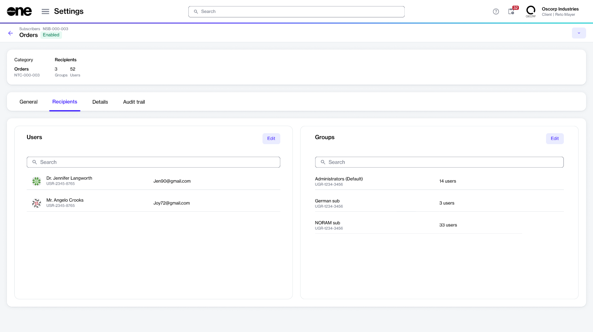
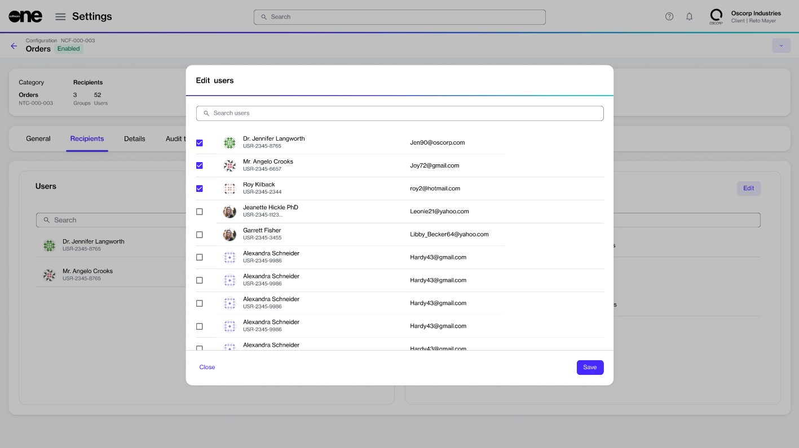
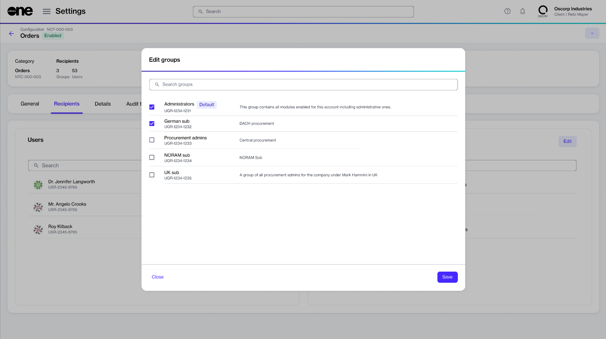

# Configure recipients

Recipients are the users and groups who receive notification emails for a category.

Categories group related notification events. When a category is enabled, and an event is triggered, the assigned recipients receive the email notification.

If a category is disabled, its recipients do not receive notification emails. To manage categories, see [Enable or disable categories](enable-or-disable-categories.md).

### Add recipients

To add recipients to a category:

1. Go to **Settings** > **Notifications**.
2. Select the **Subscribers** tab, then select the category you want to update. For example, select **Orders** for order-related notifications.
3. On the category details page, select the **Recipients** tab.

<figure><figcaption>
Use the recipients tab on the Subscriber details page to configure recipients.
</figcaption></figure>

4. Add users:
   1. Under **Users**, select **Edit**.
   2. In **Edit users**, select the users who should receive notifications.
   3. Select **Save**.
5. Add groups:
   1. Under **Groups**, select **Edit**.
   2. In **Edit groups**, select the groups that should receive notifications.
   3. Select **Save**.

### Remove recipients

To remove recipients from a category:

1. Go to **Settings** > **Notifications**.
2. Select the **Subscribers** tab, then select the category you want to update.
3. On the category details page, select the **Recipients** tab.
4. Remove users:
   1. Under **Users**, select **Edit**.
   2. Clear the checkbox next to each user you want to remove.
   3. Select **Save**.

<figure><figcaption>
Remove a user from your email notifications.
</figcaption></figure>

5. Remove groups:
   1. Under **Groups**, select **Edit**.
   2. Clear the checkbox next to each group you want to remove.
   3. Select **Save**.

<figure><figcaption>
Remove a group from your email notifications.
</figcaption></figure>

