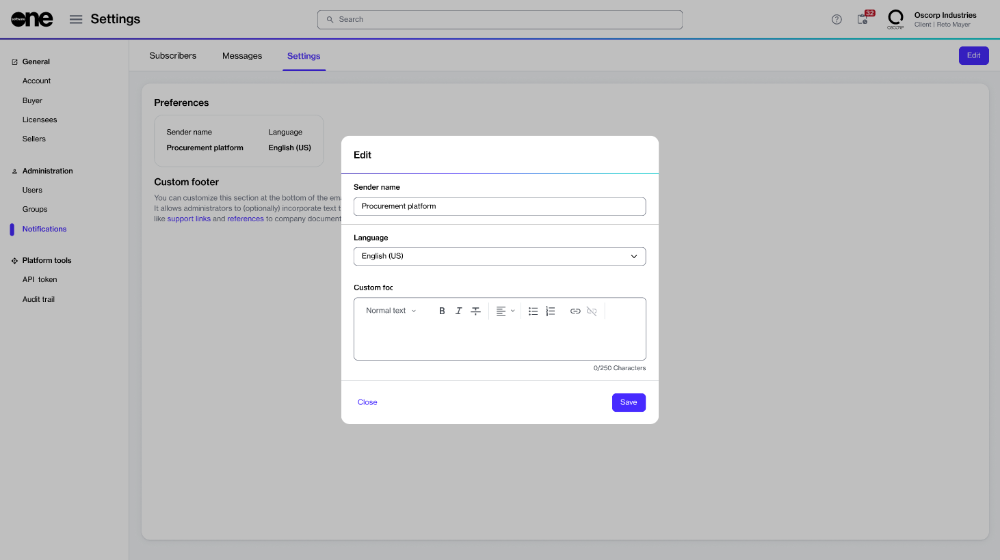

# Customize Settings

The **Settings** tab allows account administrators to customize the settings of the notification emails, including the sender's name, the language of emails, and the email footer.

The settings defined on this page are global, meaning they apply to all notification emails regardless of the category.&#x20;

## Customizing notification settings

To customize the notification settings:

1. From the main menu, go to **Settings** > **Notifications.**
2. Select the **Settings** tab.&#x20;
3. Select **Edit** in the upper right.
4. Make the following changes as necessary:
   * **Sender name** - Enter the name to display to your email recipients.
   * **Language** - Select the default language to be used for all emails sent at the account level.
   * **Custom footer** - Include any additional information to display in the footer. The content you add is displayed alongside the standard text in the footer.&#x20;

<figure><figcaption></figcaption></figure>

5. Select **Save**. Your settings are updated, and a confirmation message is displayed.
