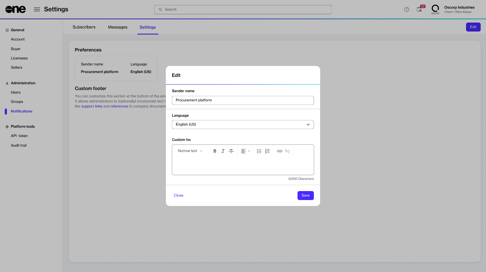

# Customize notification settings

The **Settings** tab allows account administrators to customize the global email notification settings, including the sender name displayed to recipients and the information that appears within the footer of every notification email.

When the settings are saved, they apply to all notification emails sent from the platform.

### Customizing notification email settings

To customize the settings for your notification emails:

1. Go to **Settings** > **Notifications**.
2. Select the **Settings** tab, then select **Edit**.
3. Update the following details:
   * **Sender name** - Enter the display name that will appear in your emails. This name is shown to the recipient, so we recommend using a clear and meaningful sender name.
   * **Custom footer** - Add the information you want to include in the footer of your notification emails. The details you provide appear alongside the standard platform footer.


The **Preferred language** field displays the communication language selected for your account. This field is view-only. To change the preferred language, use the **Edit** option on the [Account page](../account/). For more information, see [Update account details](../account/update-account-information.md).


<figure><figcaption>
Update the settings for your notification emails.
</figcaption></figure>

4. **Save** your settings.
