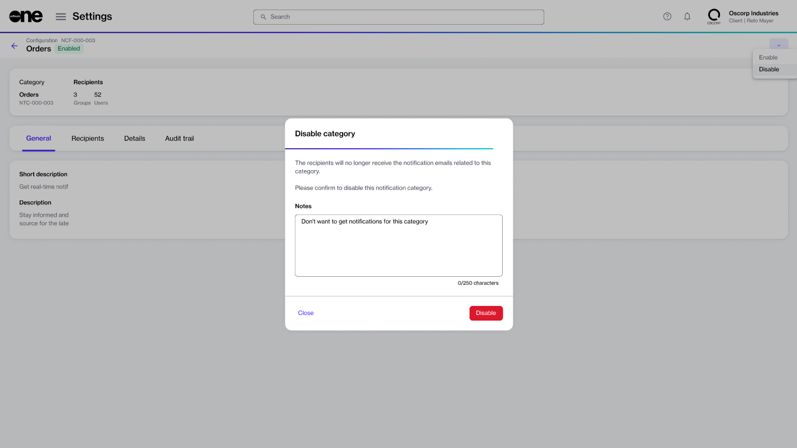

# Enable or Disable Categories

Account administrators can enable specific [notification categories](./#notification_types) to receive alerts through email.

By default, all notification categories are enabled, which means recipients assigned to these categories will receive an email whenever a specific event occurs.

Admins can stop unwanted notifications by disabling the category. This will immediately stop the notifications for all the recipients in that category until it's re-enabled. For example, if the **Subscriptions** category is disabled, all subscription-related notifications will stop.


The Marketplace Platform doesn't allow disabling email messages for profile updates, including password reset alerts and account invitation emails.


## Disabling a notification category


The steps in this section are for account administrators who want to manage categories at the account level. If you are not an administrator and want to manage notifications for your profile, follow the steps in [Manage Notification Preferences](../../../marketplace-platform/getting-started/interface/manage-notification-preferences.md).


To disable a notification category:

1. Navigate to the **Notifications** page.
2. On the **Subscribers** tab, select the required category, for example, **Orders**.
3. On the details page, select the arrowand choose **Disable**.
4. In the **Disable Category** dialog, add your comments in the **Notes** field. Then, select **Disable** to confirm the action.&#x20;

<figure><figcaption>
Disable category dialog
</figcaption></figure>

A confirmation message is displayed, and the notification emails are disabled.

## Enabling a notification category

To re-enable a previously disabled notification category:

1. Navigate to the **Notifications** page.
2. On the **Subscribers** tab, select the category you want to re-enable.
3. On the details page, select the arrow and choose **Enable**.
4. In the **Enable** dialog, add your comments in the **Notes** field and then select **Enable** to confirm the action.&#x20;

A confirmation message is displayed, and all notification emails for the category are immediately re-enabled.
