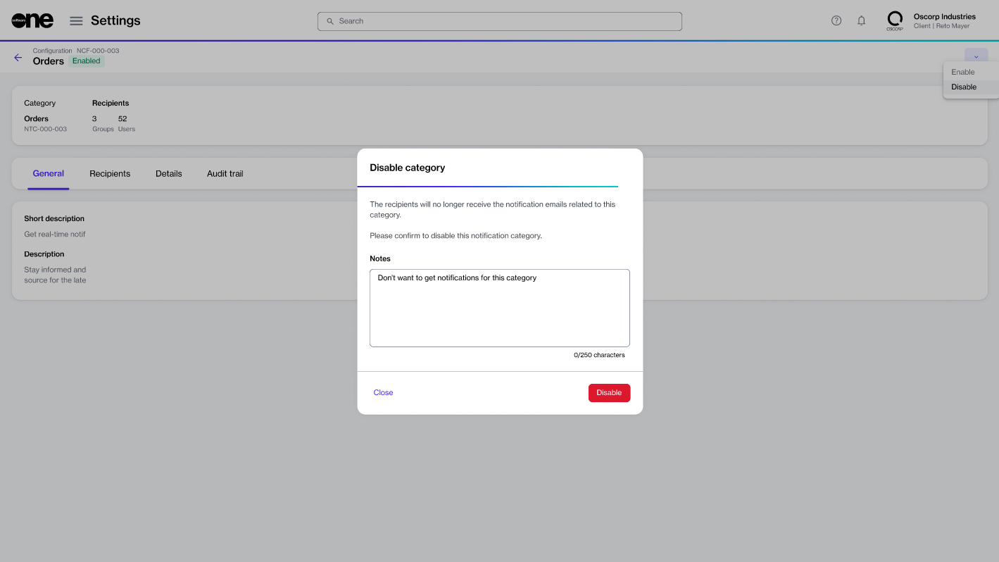

# Enable or disable categories

Account administrators can manage categories to start or stop receiving email alerts.&#x20;

By default, all notification categories are enabled. Once a category is disabled, all notifications emails for that category stop until it's re-enabled.&#x20;


You cannot disable notifications for profile updates, including password reset alerts and account invitation emails.


### Disabling a category

To disable a category:

1. Go to **Settings** > **Notifications**. &#x20;
2. Select the **Subscribers** tab. Then, select the required category, for example, **Orders**.
3. On the details page, select the dropdown arrowand choose **Disable**.
4. In the **Disable Category** dialog, add your comments to the **Notes** field.&#x20;
5. Select **Disable**. A confirmation message is displayed. All notification emails are disabled.

<figure><figcaption>
Add comments and then disable the notification category.
</figcaption></figure>

### Enabling a category

To re-enable a category:

1. Go to **Settings** > **Notifications**. &#x20;
2. Select the **Subscribers** tab. Then, select the category you want to re-enable.
3. On the details page, select the dropdown arrowand choose **Enable**.
4. In the **Enable** dialog, add comments in the **Notes** field.
5. Select **Enable**. A confirmation message is displayed. All notification emails for the category are re-enabled.
