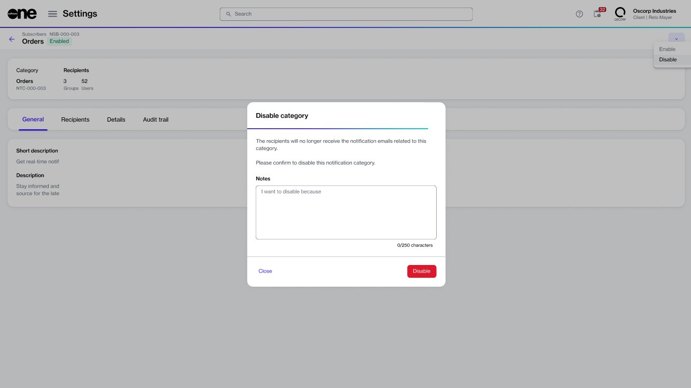

# Enable or Disable Categories

Account administrators can enable specific categories to receive email alerts.

By default, all notification categories are enabled, which means recipients assigned to these categories receive an email whenever a specific event occurs.

Administrators can stop unwanted notifications by disabling the category. This immediately stops notifications for all recipients in that category until the category is re-enabled. For example, if the **Subscriptions** category is disabled, all subscription-related notifications stop.


* To see all available categories, go to **Notifications > Subscribers**.&#x20;
* The Marketplace Platform doesn't allow disabling email messages for profile updates, including password reset alerts and account invitation emails.


## Disabling a notification category


The steps in this section are for account administrators to manage categories at the account level. To manage notifications for your individual profile, see [Manage Notification Preferences](../../../marketplace-platform/getting-started/interface/manage-notification-preferences.md).


To disable a notification category:

1. Navigate to the **Notifications** page.
2. On the **Subscribers** tab, select the required category, for example, **Orders**.
3. On the details page, select the arrowand choose **Disable**.
4. In the **Disable Category** dialog, add your comments in the **Notes** field. Then, select **Disable** to confirm the action. A confirmation message is displayed, and the notification emails are disabled.

<figure><figcaption>
The Disable Category dialog in the platform.
</figcaption></figure>

## Enabling a notification category

To re-enable a previously disabled notification category:

1. Navigate to the **Notifications** page.
2. On the **Subscribers** tab, select the category you want to re-enable.
3. On the details page, select the arrow and choose **Enable**.
4. In the **Enable** dialog, add your comments in the **Notes** field, then select **Enable** to confirm the action.&#x20;

A confirmation message is displayed, and all notification emails for the category are immediately re-enabled.
