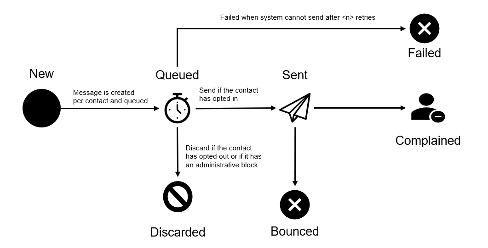

# Notification States

A notification in the Marketplace Platform goes through various states during its lifecycle.

The following diagram shows the possible states and the transition between these states:

<figure><figcaption>
Notification state transition
</figcaption></figure>

| State          | Definition                                                                                      |
| -------------- | ----------------------------------------------------------------------------------------------- |
| **New**        | The email has been created in the system. Note that this state is not visible on the interface. |
| **Queued**     | The email has been queued for sending.                                                          |
| **Discarded**  | The email has been discarded because the individual has opted out or blocked the email.         |
| **Sent**       | The notification has been sent.                                                                 |
| **Failed**     | The platform has been unable to send the notification.                                          |
| **Bounced**    |                                                                                                 |
| **Complained** |                                                                                                 |
