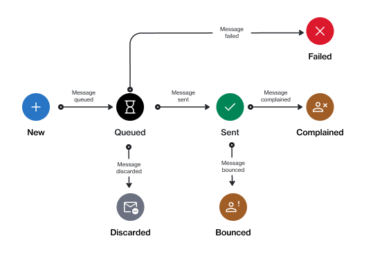

# Notification States

A notification email in the Marketplace Platform goes through several stages during its lifecycle.

The following diagram shows the possible states and the transitions between these states:

<figure><figcaption>
The state transition diagram of a notification.
</figcaption></figure>

<table><thead><tr><th width="157">State</th><th>Definition</th></tr></thead><tbody><tr><td><strong>New</strong></td><td>This is the initial status for newly created email messages. This state is not visible on the interface.</td></tr><tr><td><strong>Queued</strong></td><td>The email has been queued for sending to the recipient. </td></tr><tr><td><strong>Discarded</strong></td><td>The email has been discarded because the individual or account has disabled the category, or the contact has placed an administrative block due to bounces or complaints.</td></tr><tr><td><strong>Sent</strong></td><td>The email message has been sent to the recipient.</td></tr><tr><td><strong>Failed</strong></td><td>The platform was unable to send the email message. </td></tr><tr><td><strong>Bounced</strong></td><td>The email message bounced and couldn't be delivered. This could be due to several reasons, including invalid email addresses, issues with the recipient's mailbox, and so on.</td></tr><tr><td><strong>Complained</strong></td><td>The recipient has reported the email message as spam or junk.</td></tr></tbody></table>
