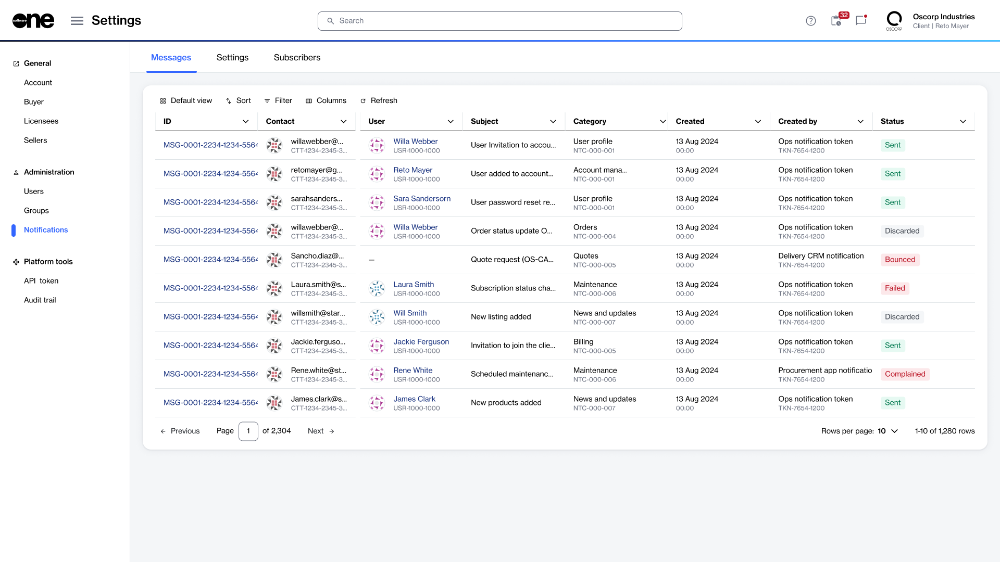
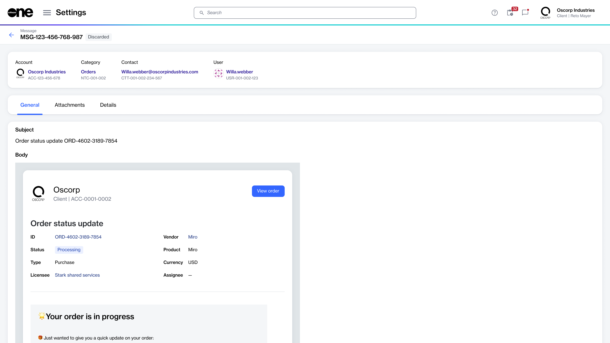

# View notification messages

Account administrators can use the **Messages** tab to view the account-level log of notification emails. The list includes emails that were sent successfully and emails with failed delivery.

### Viewing messages

To open the message list:

1. Go to **Settings** > **Notifications**.
2. Select the **Messages** tab.


The **Contact** column shows the recipient email address. The **Users** column shows the name and ID of the platform user linked to that contact. If the **Users** column is blank, the recipient does not have a platform account.


<figure><figcaption>
Use the Messages tab to view account-level log of notification emails.
</figcaption></figure>

### Viewing message details

To open the full details for a message:

1. Go to **Settings** > **Notifications**.
2. On the **Messages** tab, select the ID for the message you want to review.

The **Message details** page shows the message content, attachments, and delivery metadata.

<figure><figcaption>
Use the details page to view additional metadata.
</figcaption></figure>

