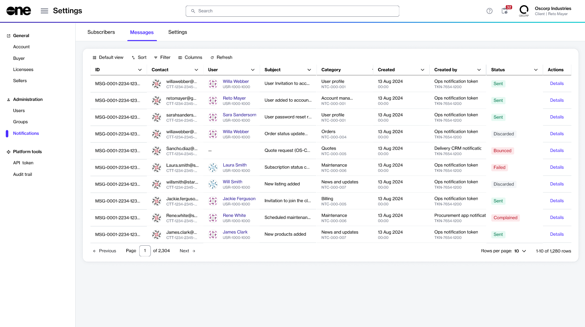
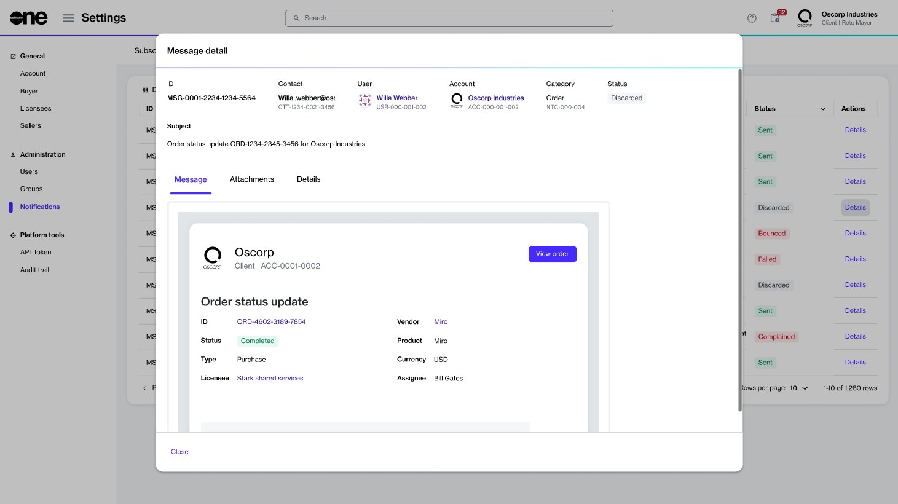

# Viewing Message Details

The **Messages** tab contains all messages sent to the users in your account.&#x20;

<figure><figcaption>
Messages tab
</figcaption></figure>

To view the message details page, select **Details** in the **Actions** column.

The **Message details** page displays message details. You can also view the content of the email, the files attached to the message, the time and date when the message was triggered, and so on.&#x20;

<figure><figcaption>
Message details page
</figcaption></figure>
