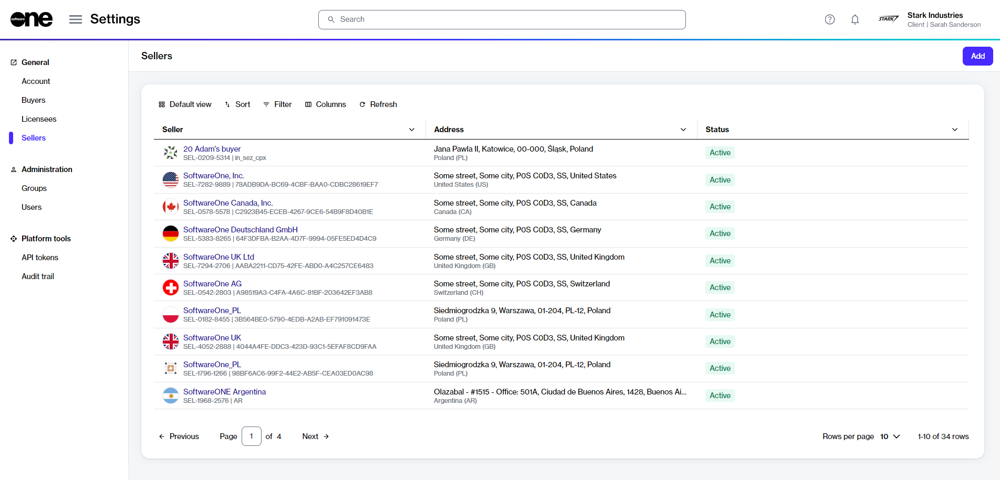

# Sellers

In the Marketplace Platform, a seller refers to a SoftwareOne legal entity that is responsible for procurement, order fulfillment, and billing. Examples of sellers include SoftwareOne UK, SoftwareOne USA, and so on. Learn more about sellers in [Key Concepts](../../marketplace-platform/getting-started/key-concepts.md).&#x20;

## Sellers interface

Account administrators can access the **Sellers** page by selecting **Settings** > **Sellers** from the main menu.

<figure><figcaption>
Sellers page
</figcaption></figure>

The page displays all sellers that have been linked to your account by SoftwareOne. For each seller, you can view the following information:&#x20;

* **Seller** - Displays the name and ID of the SoftwareOne entity.&#x20;
* **Address** - Displays the address of the SoftwareOne entity.
* **Status** - Displays the seller's status in the system. Possible values include:
  * **Active** - The seller is active and available for transactions in the Marketplace.
  * **Disabled** - The seller is not operational and cannot be used for transactions. However, you can still access any historical data related to the seller.&#x20;

## Seller details page 

The details page of a seller displays additional information about the seller. You can open the details page by clicking the seller's name on the **Sellers** page.

<figure><figcaption>
Details page of a seller
</figcaption></figure>

The details page displays the seller's name, marketplace ID, and status. It also contains the following tabs:

* **General** - Displays the seller's address.
* **Buyers** - Displays all buyers linked to the seller in the context of an account, and their details such as name and address.
* **Currencies** - Displays the list of currencies supported by the seller. SoftwareOne sellers can support transactions in multiple currencies.
* **Details** - Displays the date and time information associated with the seller object.
* **Audit trail** - Displays an audit trail of all changes. For each audit record, you can view the log details and summary. To learn more, see [Audit Trail](https://docs.platform.softwareone.com/modules-and-features/settings/audit-trail).
