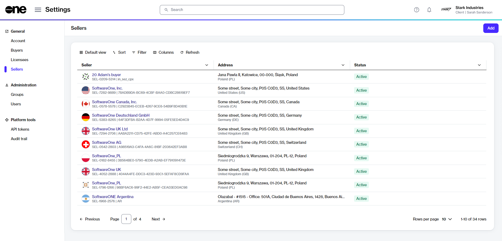
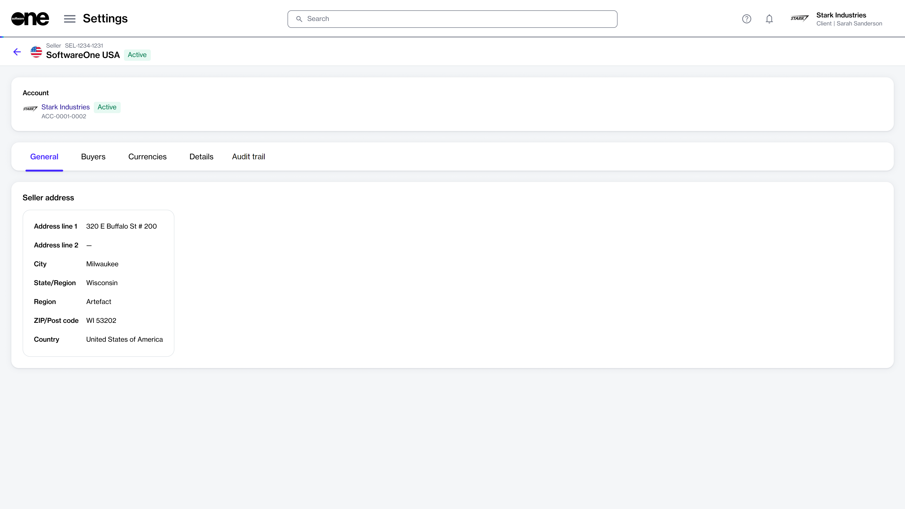

# Sellers

In the Marketplace Platform, a seller refers to a SoftwareOne legal entity that is responsible for procurement, order fulfillment, and billing. Examples of such entities include SoftwareOne UK, SoftwareOne USA, and so on.

Account administrators can view all sellers on the **Sellers** page.

<figure><figcaption>
The Sellers page in the platform.
</figcaption></figure>

The page displays all sellers linked to your account by SoftwareOne, along with their details, such as name, ID, and address. You can also view the status of each seller. See [Seller States](seller-states.md) for possible values.

### Viewing seller details 

To view the details page for a seller, select the seller on the **Sellers** page.&#x20;

<figure><figcaption>
The details page of a seller.
</figcaption></figure>

The details page displays general information, such as the seller's name and status. It also contains the following tabs:

<table><thead><tr><th width="156">Tab</th><th>Description</th></tr></thead><tbody><tr><td><strong>General</strong></td><td>Displays the seller's address information. </td></tr><tr><td><strong>Buyers</strong></td><td>
Displays all buyers linked to the SoftwareOne seller in the account, along with the buyer's name and address. 

The <strong>ERP link status</strong> is also displayed on this tab. An ERP link is a reference to the customer record in the SoftwareOne ERP system. A <strong>Blocked</strong> ERP link indicates that you cannot transact with the specified seller. In such cases, <a href="../../../help-and-support/contact-support.md">contact support</a> for assistance.
</td></tr><tr><td><strong>Currencies</strong></td><td>Displays a list of currencies supported by the seller.</td></tr><tr><td><strong>Details</strong> </td><td>Displays the log details for associated events and external IDs. You can also track when the last update occurred and when the system will perform its next synchronization with the ERP system.</td></tr><tr><td><strong>Audit trail</strong></td><td>Displays a record of events related to the seller. For more information, see see <a href="../audit-trail.md">Audit Trail</a>.</td></tr></tbody></table>
