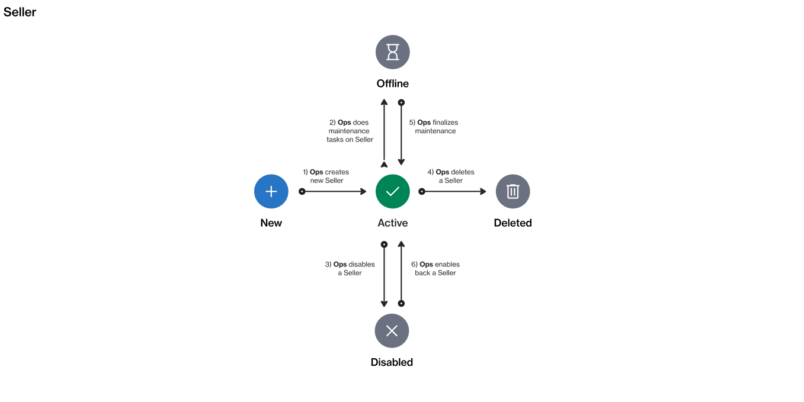

# Seller States

A seller is a SoftwareOne entity (for example, SoftwareOne Canada) that buys software products from vendors (like Microsoft) and sells those products to clients and partners.

A seller can currently exist in these states: **New**, **Active**, **Offline**, **Disabled**, or **Deleted**. The following diagram shows the transitions between these states:

<figure><figcaption>
The state transition diagram of a seller.
</figcaption></figure>

<table><thead><tr><th width="111">State</th><th>Definition</th></tr></thead><tbody><tr><td><strong>Active</strong></td><td>The seller is active and available for transactions in the Marketplace</td></tr><tr><td><strong>Offline</strong></td><td>The seller is unavailable or offline, possibly due to maintenance activities.</td></tr><tr><td><strong>Disabled</strong></td><td>The seller is not operational and cannot be used for transactions. However, you can still access any historical data related to the seller.</td></tr><tr><td><strong>Deleted</strong></td><td>The seller has been deleted. This status is not visible on the interface.</td></tr></tbody></table>
