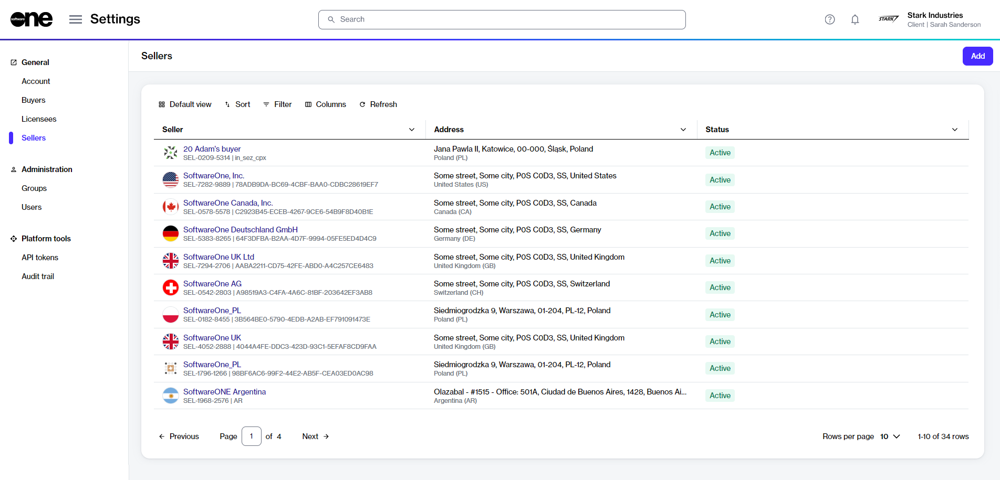

# View sellers

This topic describes how to view a list of sellers in your account, as well as details about a specific seller.

### Viewing a list of sellers 

To view a list of sellers in your account:

1. Go to **Settings** > **Sellers**.
2. View the list of all sellers displayed on the page.
3. Review key details, such as the seller's name and address. You can also check whether the seller is currently available for transactions. If a seller is unavailable or no longer operational, this is reflected in their [status](seller-states.md).

<figure><figcaption>
Use the Sellers page to view and manage sellers.
</figcaption></figure>

### Viewing seller details 

To view a specific seller:

1. Go to **Settings** > **Sellers**. A list of sellers is displayed.
2. Select the seller that you want to view. The seller details page opens.
3. Use the tabs on the seller details page to view different types of information:

<table><thead><tr><th width="180">Tab</th><th>Description</th></tr></thead><tbody><tr><td><strong>General</strong></td><td>Displays the seller's address information. </td></tr><tr><td><strong>Buyers</strong></td><td>Displays all buyers linked to the SoftwareOne seller in the account, along with the buyer's name and address. The <strong>ERP link status</strong> is also displayed on this tab. An ERP link is a reference to the customer record in the SoftwareOne ERP system. A <strong>Blocked</strong> ERP link indicates that you cannot transact with the specified seller. In such cases, <a href="../../../help-and-support/contact-support.md">contact support</a> for assistance.</td></tr><tr><td><strong>Currencies</strong></td><td>Displays the currencies supported by the seller.</td></tr><tr><td><strong>Details</strong></td><td>Displays the log details for associated events and external IDs. You can also track when the last update occurred and when the system will perform its next synchronization with the ERP system.</td></tr><tr><td><strong>Audit trail</strong></td><td>Displays the <a href="../audit-trail.md">audit trail</a> for the seller.</td></tr></tbody></table>
