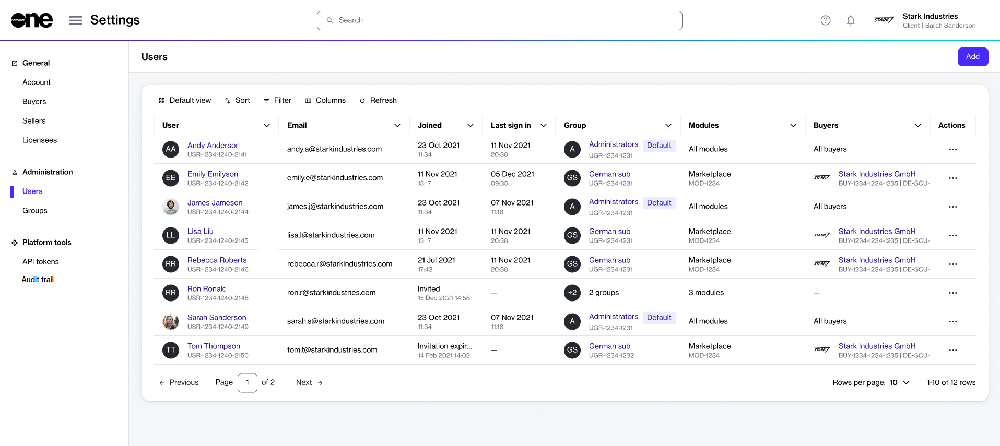
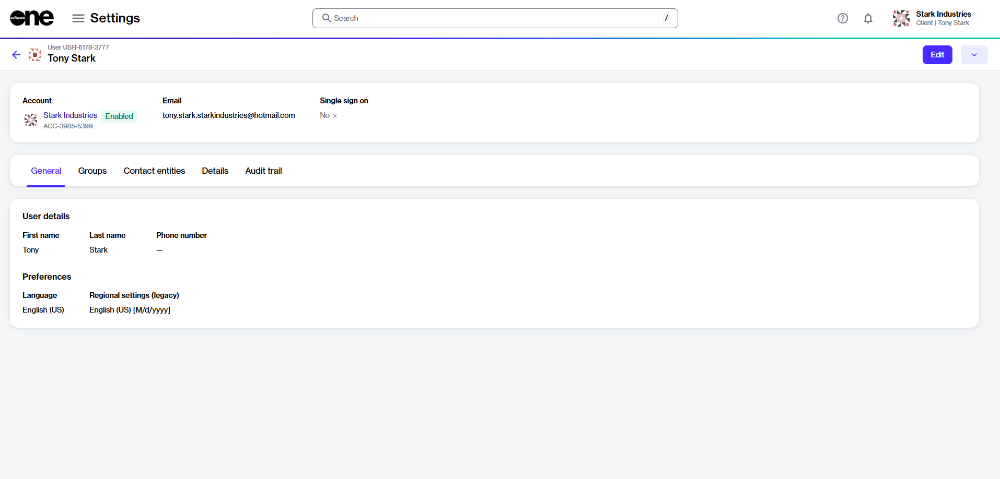

# Users

A user is an individual who interacts with the platform through a unique username and password. Each user has a profile consisting of attributes and settings (such as email address, name,  profile image, and more).&#x20;

In the Marketplace Platform:

* Users can belong to one or more accounts, or none at all.&#x20;
* Users associated with an account have tailored access to modules and functionalities, depending on their permissions.&#x20;
* Users belonging to multiple accounts can also switch between those accounts without signing out of the platform.
* Users who don't belong to any account have limited capabilities. Such users can only sign in to the platform and adjust their profile settings. They cannot access any module.

Account administrators can view and manage users from the **Users** page.

<figure><figcaption>
Users page
</figcaption></figure>

The page displays all users in your account, and allows you to view each user's details, such as their name, email address, group membership, and the date they last accessed their account.

You can also view the date when they joined the account. If the user has not yet joined, only the invitation status is displayed. See [User States](user-states.md) for information on the possible user states.

Admins can also view buyers who are visible to the user.

* If the user has access to the **Account Management** module, the column displays **All buyers** as the value. It means that users can view all buyers in the account.&#x20;
* If the user only has access to the **Marketplace** module, the total number of buyers is shown.
* If the user can only access the **Marketplace** module, the total number of buyers is displayed.
* If the user doesn't have access to either of these two modules, a dash is displayed instead.

The page also contains action links that allow you to edit a user's details or remove them from your account.&#x20;

## View user details 

To view a user's details, select the user on the **Users** page.

<figure><figcaption>
User details page
</figcaption></figure>

At the top of the details page, you can view properties, such as the user's name, ID, and email address. You can also check if single sign-on has been enabled for this user.

The user details page also contains the following tabs:

<table><thead><tr><th width="151">Tab</th><th>Description</th></tr></thead><tbody><tr><td><strong>General</strong></td><td>Displays the general user information, such as name and preferences.</td></tr><tr><td><strong>Groups</strong></td><td>Displays the user's group memberships and the modules they have access to.</td></tr><tr><td><strong>Contact entities</strong></td><td>Displays the buyers and licensees mapped to the user. Selecting the buyer or licensee name displays the details page of the selected entity.</td></tr><tr><td><strong>Details</strong> </td><td>Displays a history of events associated with the user, for example, the date and time when the user was invited to the platform, and so on.</td></tr><tr><td><strong>Audit trail</strong></td><td>Displays a detailed audit trail of all changes. To learn more, see <a href="../audit-trail.md">Audit Trail</a>.</td></tr></tbody></table>

## Additional actions

On the details page, you can perform various actions depending on the user's current status:

* [Edit user](edit-users.md)
* [Remove user](remove-user.md)
* [Manage user invitations](manage-user-invitations.md)
