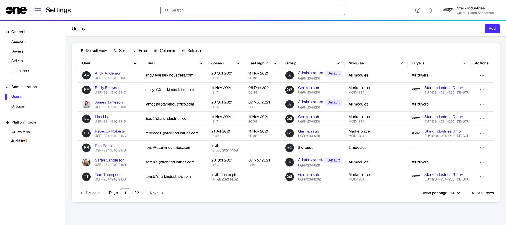

# Users

A user is an individual who interacts with the Marketplace with a unique username and password. Each user has a profile with attributes, such as email address, name, profile image, and more.

In the SoftwareOne Marketplace, users linked to an account have tailored access to modules and functionalities, depending on their permissions. Users can also belong to multiple accounts or have no account at all. Additionally:

* Users with multiple accounts can switch between them without signing out of the platform.
* Users who don't belong to any account have limited capabilities. Such users can only sign in to the platform and adjust their profile settings. They cannot access any module.

### Accessing users

The **Users** page allows account administrators to perform user management tasks, such as adding new users and managing existing users. Administrators can also modify a user, remove a user, reinvite a user to the account, and much more.&#x20;

To navigate to the **Users** page, select the main menu, then choose **Settings** > **Users**. The list of users is displayed as shown in the following image:

<figure><figcaption>
The Users page in the SoftwareOne Marketplace.
</figcaption></figure>

On the **Users** page, you can use the [sort and filter options](../../../marketplace-platform/getting-started/interface/customize-the-data-grid.md) and [show or hide specific columns](../../../marketplace-platform/getting-started/interface/customize-the-data-grid.md#managing-columns) to customize the list.&#x20;

You can view a user's details by selecting the user name, and you can manage a user by using the options in the **Actions** column.

### Related topics


[user-states.md](user-states.md)



[add-new-users.md](add-new-users.md)



[view-users.md](view-users.md)



[edit-users.md](edit-users.md)



[remove-users.md](remove-users.md)



[respond-to-invitations.md](respond-to-invitations.md)



[manage-user-invitations.md](manage-user-invitations.md)

