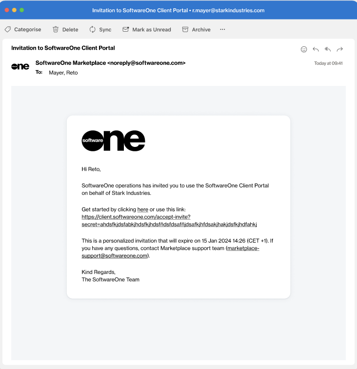

# Add new users

Account administrators can add new users to the account from the **Users** page.

Once a user is added, they will receive an invitation email containing a unique link. To join the account, the user must accept the invitation and complete the registration process within 7 days. Otherwise, the invitation expires and must be resent.

### Before you begin 

Before adding a user to your account, note the following points:

* Ensure you have the user's email address and full name.
* Make sure the user is not already added to the account. If they are, the platform displays a message.
* When adding the user, make sure to assign them to the correct group. For information on creating or updating a group, see [Groups](../groups/).

### Adding a new user to your account 

To add a new user:

1. Go to **Settings** > **Users**, then select **Add**.
2. Provide the following information for the user you want to add:
   1. **Email** - Enter the user's email address, then select **Next**.
   2. **User details** - Enter the user's first and last name, then select **Next**.
   3. **Groups** - Select the groups to which the user must be added. You must choose at least one group. When done, select **Next**.
   4. **Overview** - Review the details you have provided and select **Add**. The user is added to your account, and the invitation email is sent to them.&#x20;
   5. **Summary** - Select **View details** to view the user's details page. Otherwise, select **Close**. To share the invite link directly with the user, select the copy icon <path d=&#x22;M360-240q-33 0-56.5-23.5T280-320v-480q0-33 23.5-56.5T360-880h360q33 0 56.5 23.5T800-800v480q0 33-23.5 56.5T720-240H360Zm0-80h360v-480H360v480ZM200-80q-33 0-56.5-23.5T120-160v-560h80v560h440v80H200Zm160-240v-480 480Z&#x22;/></svg>" data-size="line">.

After adding the user, advise the user to locate the invitation email from SoftwareOne Marketplace and accept the invite.

<figure><figcaption>
SoftwareOne Marketplace's account invitation email.
</figcaption></figure>


* To resend the invitation, go to the **Users** page > select the actions icon (**•••**) for the user > select **Resend invitation link**.&#x20;
* To copy the invitation as a link and share it with the individual, go to the **Users** page > select the actions icon (**•••**) for the user > select **Copy invitation link**.&#x20;
* If the invitation has expired, go to the **Users** page > select the actions icon (**•••**) for the user > select **Send new invitation**.

To learn more, see [Manage User Invitations](https://docs.platform.softwareone.com/modules-and-features/settings/users/manage-user-invitations).

