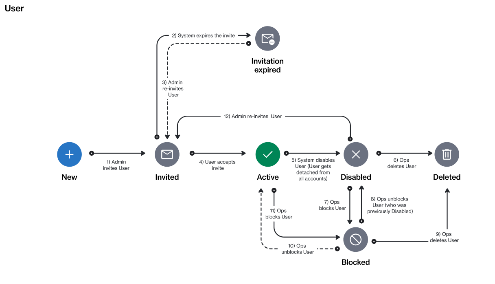

# User States

The Marketplace Platform supports various statuses for users in the system.&#x20;

The following diagram shows the possible states and the transition between these states:

<figure><figcaption>
The state transition diagram of a user.
</figcaption></figure>

Note that the Marketplace Platform supports various account types, including vendor and client, so not all states might be visible to you.

<table><thead><tr><th width="114">State</th><th>Definition</th></tr></thead><tbody><tr><td><strong>Invited</strong></td><td>
The user has been invited to join the account but has not accepted the invite yet.

This status remains in place until the invitation is accepted.
</td></tr><tr><td><strong>Invitation expired</strong></td><td>The user's invitation has expired because they didn't accept it within 7 days from the send date.</td></tr><tr><td><strong>Active</strong></td><td>The user can access the account and perform operations based on their permissions.</td></tr><tr><td><strong>Blocked</strong></td><td>
The user has been restricted from accessing the account. 

This could be due to terms and conditions violations, security concerns, or at the administrator's discretion.
</td></tr><tr><td><strong>Disabled</strong></td><td>The user has been removed from the account. They cannot perform any operation in the account.</td></tr><tr><td><strong>Deleted</strong></td><td>The user no longer exists in the system.</td></tr></tbody></table>
