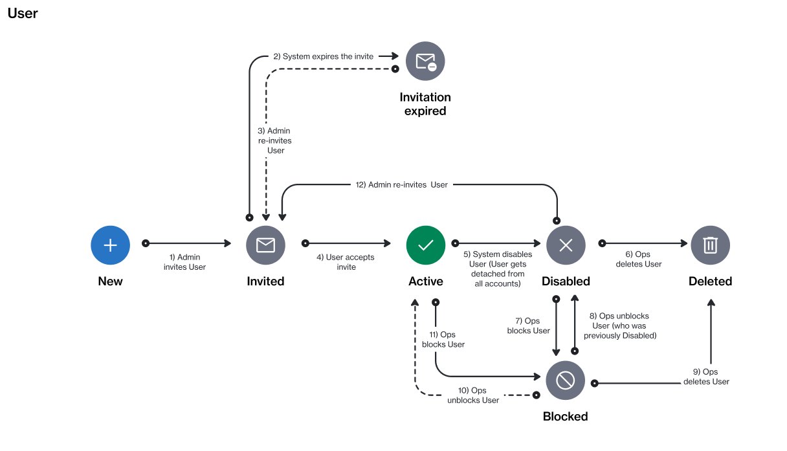

# User status

A user is an individual with a unique login who interacts with the Marketplace Platform.&#x20;

A user can currently exist in these states: **Invited**, **Invitation expired**, **Active**, **Blocked**, **Disabled**, or **Deleted**. The following diagram shows the transitions between these states:

<figure><figcaption>
The state transition diagram of a user.
</figcaption></figure>

The following table provides a description of the different states:

<table><thead><tr><th width="180">State</th><th>Description</th></tr></thead><tbody><tr><td><strong>Invited</strong></td><td>The user has been invited to the account.</td></tr><tr><td><strong>Invitation expired</strong></td><td>The user's invitation has expired because they didn't accept it within 7 days from the send date.</td></tr><tr><td><strong>Active</strong></td><td>The user can access the account and perform operations based on their permissions.</td></tr><tr><td><strong>Blocked</strong></td><td>The user has been restricted from accessing the account. This could be due to terms and conditions violations, security concerns, or at the administrator's discretion.</td></tr><tr><td><strong>Disabled</strong></td><td>The user has been removed from the account. They cannot perform any operation in the account.</td></tr><tr><td><strong>Deleted</strong></td><td>The user no longer exists in the system.</td></tr></tbody></table>
