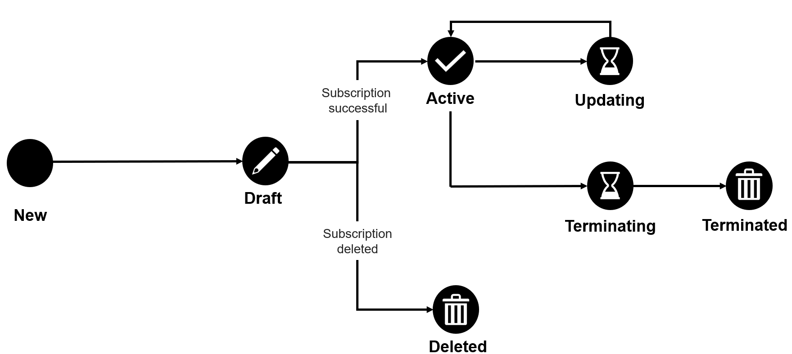

# Subscription States

Subscriptions in the Marketplace Platform can be in multiple states (also known as status) during their lifecycle.&#x20;

The following diagram shows the possible states and the transition between these states:

<figure><figcaption>
Subscription state transition
</figcaption></figure>

The subscription states are visible in the platform as **Status**. These states are also displayed as an icon beside the name of the subscription and its ID on the details page.

<table><thead><tr><th width="144">State</th><th>Definition</th></tr></thead><tbody><tr><td><strong>Draft</strong></td><td>The vendor has created the subscription but the order is not completed yet.</td></tr><tr><td><strong>Active</strong></td><td>
The subscription is currently in use. 

It has items attached to it in positive quantities.
</td></tr><tr><td><strong>Updating</strong></td><td>
A business transaction is in progress for the subscription. 

This status applies to change orders submitted for at least one item attached to the subscription.
</td></tr><tr><td><strong>Terminating</strong></td><td>A termination order is in progress for the subscription.</td></tr><tr><td><strong>Terminated</strong></td><td>The vendor has completed the termination order associated with the subscription and terminated the subscription.</td></tr><tr><td><strong>Deleted</strong></td><td>The draft subscription has been deleted by the vendor.</td></tr></tbody></table>

## Related topics


[subscriptions-interface.md](subscriptions-interface.md)



[rename-a-subscription.md](rename-a-subscription.md)



[adjust-subscription-quantity.md](../../../marketplace-platform/getting-started/marketplace-for-clients/adjust-subscription-quantity.md)



[edit-subscription-id.md](edit-subscription-id.md)



[terminate-a-subscription.md](terminate-a-subscription.md)

