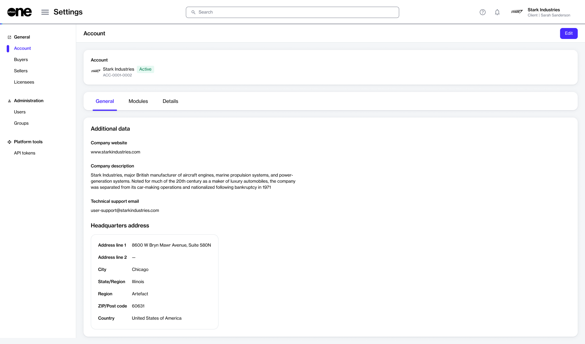

# Account Interface

The **Account** page, located under **Settings** > **Account**, displays all information about your account.

<figure><figcaption>
Account page
</figcaption></figure>

On this page, you can view your account information including your account name and its logo and your account's marketplace identifier. The **Account** page also contains the following tabs:

* **General** - Displays the additional data related to your account, such as your company website and description, support email address, and headquarters address.&#x20;
* **Modules** - Displays the modules that SoftwareOne has enabled for your account.&#x20;
* **Details** - Displays the date and time your account was created on the platform. If you made any changes to your account, for example, if you changed the address, the last updated date and time is also displayed.

## Related topics


[.](./)



[update-account-information.md](update-account-information.md)

