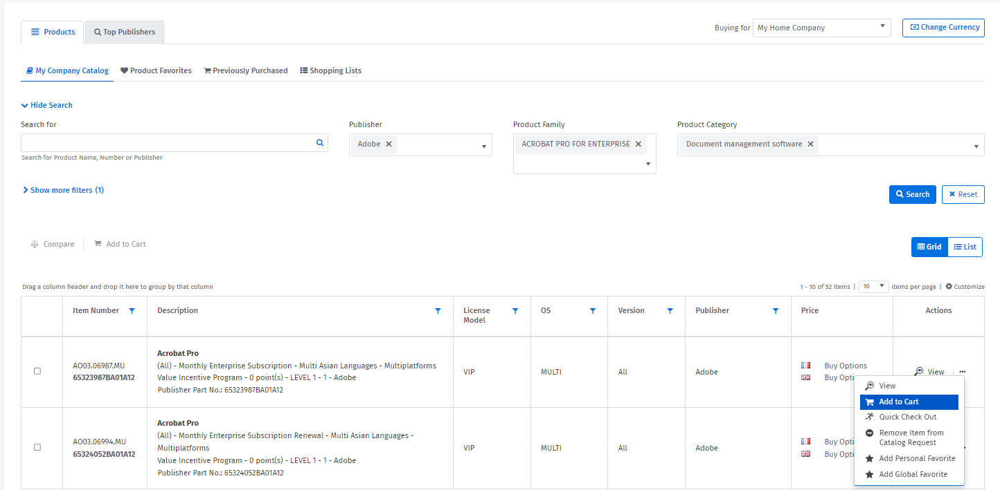

# Buy products and services

The **Products** page can be accessed by navigating to **Marketplace** > **Products**.&#x20;

On the Products page, you can easily explore our catalog, search for products, view product prices, and add products to your shopping cart. You can also [request pricing for non-catalog items](../../procurement/special-quotes/request-pricing-for-non-catalog-products.md).&#x20;

**To buy a product**

1. Navigate to the **Products** page.&#x20;
2. On the **Products** page, select the **Products** or **Top Publishers** tab and then search for the product.
3. Select the product from the list of recommended results (displayed as you're typing) or select **Search** to view all products.&#x20;

<figure><figcaption></figcaption></figure>

3. When the product details are displayed, select the ellipsis ( ••• ) in the **Actions** column and choose **Add to Cart**.&#x20;

<figure><figcaption></figcaption></figure>

4. In the Add to Cart dialog_, c_onfirm that you want to add the product to your cart. A confirmation message is displayed when the product is added.
5. Navigate to your cart and select **Create Order**. You can access your cart by selecting the **Go to Shopping Cart** link in the confirmation message or through the main menu (**Marketplace** > **Cart**).
6. Verify your address information, edit it if necessary, and provide your contact details, including your email address.
7. Choose your payment method, and provide your reference name, and purchase order number.
8. Select **Create Order** to submit your order.

Your order is created and a confirmation message is displayed. To download your order confirmation, select  **Download PDF** on the Order Details page.
