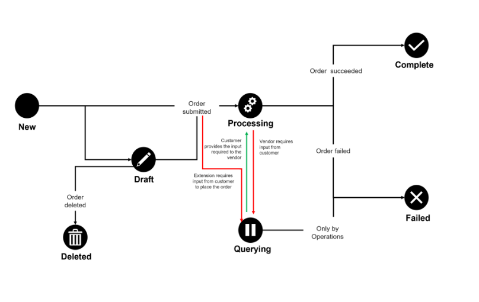

# Order States

An order can have several states from the time it is created in the Marketplace Platform until its completion.

The following diagram shows the possible states an order can have and the transition between these states:

<figure><figcaption>
Order state transition
</figcaption></figure>

These states are displayed as **Status** within the platform. They are also displayed as an icon beside the agreement name and ID on the details page.&#x20;

<table><thead><tr><th width="155">Order state</th><th>Description</th></tr></thead><tbody><tr><td><strong>Draft</strong></td><td>
The order has been saved as a draft. This status applies to orders saved as a draft during the ordering process. 

Draft purchase orders can be accessed through the <a href="orders-interface.md">Orders </a>page to finalize the order. 
</td></tr><tr><td><strong>Processing</strong></td><td>The order has been created and is currently awaiting processing by the vendor. </td></tr><tr><td><strong>Querying</strong></td><td>The ordering parameters are updated by the vendor, and the order now requires an action to be taken by the client account user.</td></tr><tr><td><strong>Completed</strong></td><td> The order has been processed by the vendor.</td></tr><tr><td><strong>Failed</strong></td><td>
The order has been failed by the vendor or SoftwareOne. 

Client account users can view the failure reason on the <strong>General</strong> tab of the order.
</td></tr><tr><td><strong>Deleted</strong></td><td>The draft purchase order has been deleted by a client account user. </td></tr></tbody></table>

Note that the Marketplace Platform supports various account types, including vendor and client, so depending on your account type, only some states might be visible to you.
